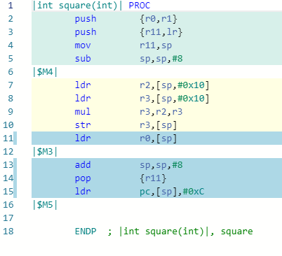
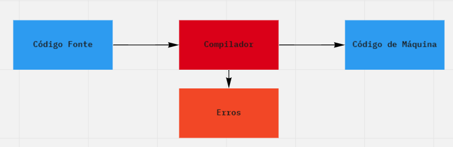
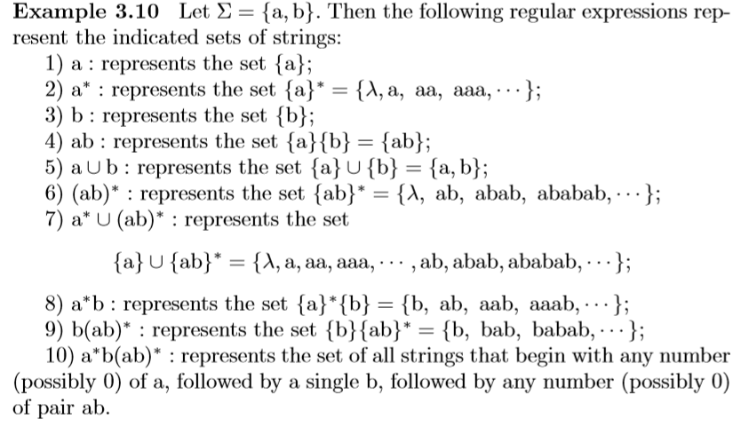

# Introdução {.P} 

 {.P}

> "The tools we use have a profound (and devious!) influence on our thinking habits, and, therefore, on our thinking abilities."   Edsger Dijkstra {.P}

 {.P}

A humanidade desenvolveu a capacidade de entender o átomo graças a sua capacidade de pensar. A principal ferramenta do pensamento é a linguagem. Linguagens diferentes permitem formas diferentes de pensar, formas diferentes de resolver problemas.

Graças a criação de linguagens desenvolvidas proposital, matemática e formalmente, a humanidade  conseguiu criar máquinas capazes de resolver qualquer problemas de forma rápica e precisa. Não seria nenhum exagero afirmar que todo o desenvolvimento que vimos durante a segunda metade do Século XX foi devido as linguagens de programação.

## Introdução {.P}

 {.P}

Veremos um pouco da história da computação, os conceitos de compilação e interpretação e a matemática que suporta a criação de linguagens de programação. {.P}

Que não restem dúvidas a leitora, durante todo este livro, o termo máquina se refere aos computadores, de qualquer tamanho, gênero e grau. Se você chegou até este ponto já sabe que computadores são coleções de software e hardware que usamos para resolver problemas. A referência a este conjunto complexo de forma abstrata como máquina parece ser a forma mais simples de definir o universo com o qual nos  preocupamos. Contudo, se olharmos com um pouco mais de detalhe poderemos traçar uma linha divisória entre o que é sólido e físico e o que abstrato e virtual.

Vamos tratar de máquinas abstratas feitas para entender a linguagem que os programadores usam para criar algoritmos e resolver problemas. {.P}

Usamos a palavra programadores de forma displicente, quase como use fora uma gíria, para representar, cientistas da computação, entenheiros de computação, analistas de sistemas e outros profissionais relacionados a ciência da computação tanto na sua forma pura quanto em aplicações.

Programadores usam linguagens de programação para escrever o código que, quando executado, irá solucionar problemas e permitir que a humanidade avance com a criação novas tecnologias que trarão novos problemas para os programadores resolverem. Uma parte muito importante da eficiência destas soluções reside na forma como este código será entendido e executado pela máquina. Este é um trabalho delegado as tecnologias de compilação e interpretação, ainda que a fronteira entre estas tecnologias seja difusa.

Vamos explorar os processos de tradução que são utilizados por compiladores e interpretadores. E, principalmente, entender esta tecnologia. {.P}

 {.P}

## Um pouco de História {.P}

 

Poderíamos dizer que a história da computação começou quando o primeiro homem colocou algumas pedras no chão para saber com quantas ovelhas saiu para o pasto e com quantas voltou. {.P}

Muitos estudiosos acreditam que a computação começou junto com a matemática e a contabilidade. A própria palavra computação tem origem no verbo latino *computare* que significa fazer cálculos. Outros autores, que se dedicam a este tema marcam o começo da computação na criação da Máquina Analítica por Charles Babbage.

__Charles Babbage__, um matemático do Século XIX teve seu trabalho reconhecido além da matemática a partir da década de 1930 quando
pesquisadores dos dois lados do Oceano Atlântico estavam desenvolvendo máquinas eletrônicas para cálculos. Ainda assim, a primeira grande bibliografia de Charles Babbage só seria publicada em 1982. Do ponto de vista da computação dois dos seus conceitos são considerados como a base da computação: a __*máquina analítica*__ e a __*máquina diferencial*__. No desenvolvimento da *máquina analítica*, que pode ser vista na Figura 1, Babbage foi parcialmente ajudado por Ada Lovelace, dama da sociedade britânica e filha do poeta __George Gordon Byron__, Lord Byron).

## Figura 1: A máquina Analítica de Charles Babbage. 

{width="2.470138888888889in" height="3.0in" } 

<small>Fonte: (BARRAL, 2009)</small> 

__Ada Lovelace__, Lady Byron, traduziu para o Inglês um manuscrito escrito em francês por um matemático italiano (Luigi Manabrea) e, atendendo uma sugestão do próprio Babbage, fez anotações pessoais na sua tradução sobre como usar a *máquina analitica* nos cálculos sugeridos no manuscrito. Todo o trabalho de Lovelace e Babbage seria apenas uma nota de rodapé na história não fossem as instruções que __Ada Lovelace__ escreveu  sobre como seria possível utilizar a *máquina analítica* para calcular
os Números de Bernoulli. Estas notas são consideradas como sendo a expressão do primeiro programa. A tradução de Ada e suas notas estão disponíveis *on line* e podem ser encontradas no __Fourmilab__ (MENABREA, 1842).

Vamos marcar o começo da computação em algum trabalho científico do começo do Século XX. Talvez, os Trabalhos de Turing sejam o ponto ideal mas, falaremos sobre isso em outro tópico. {.P}

 

## Os primeiros anos {.P}

 

O conceito de linguagem de programação começou a ser construído a partir de 1946 com a criação de __*Plankalkül*__ por __Konrad Suze__, um engenheiro alemão que criou o primeiro computador com relés e com a sua própria linguagem de programação, __*Plankalkül*__. {.P}  

 {.P}

Esta linguagem __*Plankalkül*__[^1], ainda que embrionária já poderia ser classificada como imperativa e altamente tipada. o trabalho de __Suze__ não foi publicado até a década de 1970, devido ao preconceito inerente a ciência por causa das restrições impostas a Alemanha pela Segunda Guerra Mundial. Em 1949 [__John W. Mauchly__](https://en.wikipedia.org/wiki/John_Mauchly) apresenta uma linguagem chamada de *Short Code*, a base para o desenvolvimento UNIVAC a primeira máquina que pode ser chamada de computador eletrônico e que então representava (BERGIN, 1996) o maior conjunto de equipamentos eletrônicos interligados . No caso da linguagem __*Short Code*__, a compilação era feita a mão, uma instrução era posta em execução após a outra, formando uma lista de instruções na ordem em que deveriam ser executadas e, talvez tenha sido neste momento que a palavra compilador começou a ter o sentido que tem hoje. Compilar, é na verdade, a tarefa de colocar em listas.

## Grace Hopper {.P}

 {.P}

Podemos correr o risco de afirmar que o compilador, foi criado em 1951 pela equipe liderada por [__Grace Hopper__](https://en.wikipedia.org/wiki/Grace_Hopper) enquanto trabalhava na Remington Rand, e chamado de __*A-0*__. {.P}

Em 1955 a linguagem utilizada pelo sistema de colocação em listas automático, um sistema capaz de compilar uma lista, foi liberada pela equipe de  para uso com o nome ***Math-Matic***. Este novo ambiente tecnológico, compilador e linguagem de programação, foi utilizado em máquina comercias: UNIVAC e UNIVAC II. 

 {.P}

## Fortran, Algol e Cobol {.P}

 {.P}

Poucos anos depois, em 1957 [__John Backus__](https://en.wikipedia.org/wiki/John_Backus), trabalhando na IBM, criou o __*Fortran*__ (**FOR**mula **TRAN**slation). {.P}

A vida do __*Fortran*__ foi curta, a linguagem foi modificada e rapidamente substituída pelo ***Fortran II*** em 1958. Sendo esta versão a que deve ser considerada quando estamos falando do avanço da ciência da computação. A amável leitora há de perdorar este escriba quando ele tomar a liberdade de, a partir deste momento, usar apenas a palavra __*Fortran*__ para se referir a esta linguagem. Afinal, o __*Fortran*__ continua, até o ano de 2020 gozando de boa saúde e sendo representado pelo __*Fortran 2018*__ que, como o nome indica, foi lançado em 2018 e inclui, entre outras maravilhas conceitos de programação paralela e concorrente.

O __*Fortran*__ permitia o uso de sub-rotinas, na época uma inovação revolucionária, dando origem as linguagens de programação modulares. Contudo, como *Fortran II* estava umbilicalmente ligado a IBM, apesar do seu sucesso, a linguagem foi evitada por organismos técnicos e científicos com o objetivo de manter todo o processo de criação de programas de computadores livres das influências e restrições comerciais que poderiam ser impostas pela IBM e garantir a portabilidade dos programas entre os diversos fabricantes de hardware na esperança de garantir a interoperabilidade entre programas diferentes, programadores diferentes e empresas diferentes. O ano de 1957, o ano do lançamento do *Fortran* foi um ano muito produtivo. 

Em 1957 [__Noan Chomsky__](https://en.wikipedia.org/wiki/Noam_Chomsky) publicou o livro __*Syntactic Structures*__[^2] sintetizando anos de seu trabalho no estudo da complexidade das gramáticas. 

Entre os conceitos apresentados por __*Chomsky*__ estava o conceito de _gramáticas livres de contexto_, que se mostrou extremamente útil para a descrição da sintaxe de linguagens formais, principalmente para as linguagens de programação. {.P} 

 {.P}

Sob a influência do trabalho de Chomsky, as especificações do __*ALGOL*__ foram publicadas por um comitê, auto proclamado como mundial, de desenvolvimento incluindo engenheiros dos EUA representados pela ACM (*Association of Computing Machinery*[^3]) e da Europa, representados pelo GAMM (*Gesellschaft für Angewandte Mathematik und Mechanik*[^4]) no Instituto Federal de Tecnologia em Zurique. Com três sintaxes diferentes: referência, publicação e implementação, o __*ALGOL*__ podia ser utilizada com sistemas de numeração diferentes e em idiomas diferentes. O __*ALGOL*__ tem um lugar especial na história da computação. 

##  BNF e Algol {.P}

 {.P}

[__John Backus__](https://en.wikipedia.org/wiki/John_Backus), criou uma linguagem de programação apenas para provar que um processo de descrição, por meio de uma linguagem específica, poderia ser usado para criar uma linguagem de programação, esta meta linguagem recebeu o nome de  __*Backus Normal Form*__. {.P}

Anos depois, em 1960 [__Peter Naur__](https://en.wikipedia.org/wiki/Peter_Naur), reviu e expandiu
a linguagem criada por Backus_ e, atendendo uma sugestão de [__Donald Knuth__](https://en.wikipedia.org/wiki/Donald_Knuth),
mudou o seu nome para __*Backus-Naur Form*__.

O __*ALGOL-60*__, marca a primeira vez em que uma linguagem baseada em uma notação formal, __*Backus-Naur-Form*__¸ foi usada para definir uma linguagem de programação. {.P}

 {.P}

A linguagem __*ALGOL-60*__ foi responsável por estabelecer as bases para a criação do compilador moderno (NAUR, BACKUS, *et al.*, 1963) e está diretamente ligada a todas a linguagues de programação que usamos neste início de Século XXI. O impacto do ALGOL-60 foi gigantesco no mundo das linguagens de programação. Contudo, comercialmente, a linguagem foi um fracasso. Talvez por ,motivos comerciais, a maior parte do hardware da época era produzido pela IBM, talvez por causa da popularidade do FORTRAN, talvez por causa da complexidade da linguagem.

Em 1958, enquanto o __*Fortran II*__ decolava entre os pesquisadores voltados para aplicações científicas e matemáticas, no MIT - __Massachusetts Institute of Technology__, [__John McCarthy__](https://en.wikipedia.org/wiki/John_McCarthy_(computer_scientist)), fundador da pesquisa em inteligência artificial,inicia a pesquisa no desenvolvimento da linguagem __*LISP*__, a linguagem que dá origem a praticamente todas as linguagens funcionais. Em 1959 surge o *Lisp 1.5* e cria definitivamente, os paradigmas do que chamamos hoje de linguagem funcional.

## Figura 2: Grace Hopper - Uma das inventoras do compilador moderno. 

{width="2.470138888888889in" height="3.0in" } 

<small>Fonte: (DAVIS, 1984) .</small> 

Em 1959, é publicado o __*COBOL*__, por um comitê de pesquisadores liderados por Grace Hopper. A mesma Grace Hopper que
alguns anos antes havia trabalhado na criação do primeiro compilador. {.P}

## Os anos 1970, o Basic e o C {.P}

 {.P}

No dia 1º de Maio de 1964, aproximadamente as 4:00h foi executado o primeiro programa em *Basic*, fruto do trabalho de John G. Kemeny e Thomas E. Kurtz, no Dartmouth College. {.P}

A década de 1970 é profícua na criação de linguagens de programação: *Mumps*, *Forth*, *Smaltalk* e *Scheme* (um dialeto do *Lisp*) e a linguagem __*C*__. 

O __*C*__, criado em 1972 por [__Dennis Ritchie__](https://en.wikipedia.org/wiki/Dennis_Ritchie) nos laboratórios da Bell para ser utilizada no Sistema Operacional Unix desenvolvida sobre outra linguagem a B, que fora desenvolvida por __*Ken Thompson*__ para permitir o porte do Unix para o computador PDP-11. {.P}

O B era muito lento e as modificações criadas, sob demanda e de forma urgente, por __Ritchie__ permitiram que uma versão do __*C*__ e seu compilador fossem incluídas na versão 2 do Unix. Mas, precisamos ser justos, o __*C*__ é o resultado de uma longa linha evolucionária que pode ser traçada até o __Algol__, como pode ser visto na Tabela 1.

## Tabela 1 - História das Versões da linguagem C {.P}

 {.P}

__LINGUAGEM__  __ANO__ __DESENVOLVIDA POR__
-------------- ------  -----------------------------------
Algol          1960    International Group (Backus-Naur)
BCPL           1967    Martin Richard
B              1970    Ken Thompson
C              1972    Dennis Ritchie
K & R C        1978    Brian Kernighan & Dennis Ritchie
ANSI C         1989    Comitê ANSI
ANSI/ISO C     1990    Comitê ISO
C99            1999    Comitê de Padronização da ISO
C18            2018    Comitê de Padronização da ISO {.P}

<small>Fonte: o autor (2020) .</small> {.P}

 {.P}

Como __Ritchie__ e __Thompson__ trabalharam juntos na transformação do B em C, não é raro atribuir a parternidade do C a estes dois pesquisadores. No mesmo ano da criação do *C*, [__Robin Milner__](https://en.wikipedia.org/wiki/Robin_Milner), trabalhando com seus colegas da Universidade de Edinburgh na aplicação da lógica em funções computáveis apresentou a linguagem __*ML*__ (Meta-Language) com o objetivo de criar um mecanismo interativo para prova automática de teoremas. Esta linguagem influenciou a criação das linguagens C++, Haskell e hoje seus dialetos mais importantes são o *SML* (*Standard ML*) e o *OCaml*. 

Em 1978 surge a *AWK*, uma linguagem para o processamento de textos nomeada em homenagem aos seus autores: Aho, Weinberger e Kernighan. Este é o mesmo Aho que escreveu __*Compilers: Principles, Techniques e Tools*__[^5] junto com Monica S. Lam, Ravi Sethi e Jeffrey D. Ullman. Este livro ainda é, quase cinquenta anos depois, o livro de referência para a ciência da compilação. Está vivo e sendo atualizado. 

Em 1984, em plena revolução dos microcomputadores, tanto a Microsoft quanto a Digital Research lançam versões do __*C*__ para sistemas operacionais de microcomputadores. O DOS, pela Microsoft e o DR-DOS, pela Digital Research. Este lançamento é o pano de fundo da guerra do __DOS__. 

A Microsoft saiu vencedora da guerra do __DOS__ principalmente por que o Windows 3.11 não era 100% compatível com o DR-DOS e, se tiver tempo, esta é uma história com cheia de espionagem e golpes mercadológicos muito interessantes, mas que fogem do escopo deste livro. 

## O C++ e o Java {.P}

Em 1984 que é publicada a primeira versão do __C++__ por [__Bjarne Stroustrup__](https://en.wikipedia.org/wiki/Bjarne_Stroustrup), a partir da tese desenvolvida em seu doutorado no ano de 1979, dando um impulso significativo as linguagens de programação orientadas a objeto. {.P}

__Stroustrup__ criou uma das linguagens de programação com maior sucesso na história. O __C++__ deve muitos dos seus conceitos tanto ao __C__ quanto a __SIMULA__, projeto de [__Ole-Johan Dahl__](https://en.wikipedia.org/wiki/Ole-Johan_Dahl) e [__Kristen Nygaard__](https://en.wikipedia.org/wiki/Kristen_Nygaard) no Norwegian Computing Centre (NCC) em Oslo entre 1962 e 1967, a primeira linguagem de programação a aplicar conceitos de programação orientada à objetos e criada para ser uma lingagem capaz de descrever e simular objetos e eventos da vida real. A __Simula__ também tem sua origem relacionada ao __ALGOL__. O próximo salto tecnológico deve ser atribuído ao __JAVA__.

Criado por [__James Gosling__](https://en.wikipedia.org/wiki/James_Gosling), da Sun Microsystems, além de adotar todos os paradigmas da programação orientada a objetos inova na criação de novas técnicas de compilação e interpretação. Na busca do Eldorado representado pela possibilidade de escrever um único código e rodar em qualquer máquina. Lembre-se, este foi um dos motivos que lá nos anos 1960, o mercado não adotou o __Fortran__ como linguagem de programação universal.

## E surge a WeB e a computação Quântica {.P}

{.P}

E chegamos a era da web, __Rasmus Lerdorf__ com o __PHP__ (1994), __Guido Van Rossum__ com o __Python__ (1989) e __Brendan Eich__ com o Javascript (1995) movimentam a Internet permitindo a expansão da web e a criação de tecnologias remotas e interativas. {.P}

A toda a interatividade e multiplicação de conhecimento devida a web, cria um ambiente propício para o desenvolvimento de técnicas e tecnologias relacionadas a inteligência artificial e ao aprendizado de máquina e fortalece o __Python__ de __Van Rossum__ (1989) como a linguagem mais utilizada em ciência de dados. Logo depois disso, surgem as linguagens __R__ e __Julia__, voltadas para o processamento estatístico de grandes quantidades de dados. 

Na segunda década do Século XXI, chegamos as linguagens voltadas para a computação quântica: __CIRQ__, do Google; __Q\#__ da Microsoft e __Q__ da IBM {.P}

Esta nossa viagem pela história das linguagens de programação está longe de ser completa. Na verdade, é uma lista até modesta. Foram citadas apenas as linguagens de programação que tiveram impacto nos processos de compilação e interpretação. Afinal, este é um livro sobre compiladores e interpretadores. Somos obrigados a falar de linguagens de programação, mas apenas daquelas que interessam.

# Linguagem de Máquina {.P}

Usamos máquinas para resolver problemas desde que o primeiro homem utilizou um graveto para pegar uma fruta ou matar um animal. {.P}

Estas máquinas evoluíram do graveto ao computador quântico, passando pela alavanca, o motor a vapor e o avião em pouco mais de 100.000 anos. 

Apenas no Século XX conseguimos nos comunicar com as máquinas e conseguimos dizer o que queremos que elas façam. {.P} 

Ainda que para conseguir comunicar nossas ideias às máquinas tenhamos sido forçados a desenvolver dois tipos de linguagens uma, formal e regular para que os homens possam entender e outra, também formal e regular para que a máquina possa entender o que queremos que ela faça. Nestes tempos de anglicismos tecnológicos a máquina é o *hardware*. A linguagem com que nos comunicamos é o *software.* Para os nossos objetivos, tanto a palavra hardware quanto a palavra software são por demais imprecisas.

O hardware diz respeito a toda a máquina, e a nós interessa apenas o conjunto formado pela unidade central de processamento (CPU), as
memórias e os dispositivos de entrada e saída. Considere este generalíssimo um mal necessário. É com este conjunto de dispositivos que
podemos descrever o modelo de computação desenvolvido no começo do Século XX por John Von Neumann que, com poucas modificações até o começo do Século XXI é a base de todos os computadores que regem nossa vida moderna.

## Hardware {.P}

O conjunto formado pela CPU, memória e dispositivos de entrada e saída é responsável pela execução direta de todas as instruções que desejamos que a máquina execute. Este conjunto de dispositivos entende apenas os símbolos 0 e 1 (zero e um). Esta é uma linguagem, baseada apenas em um conjunto de símbolos, ou alfabeto, definido por: $\Sigma_{b} = \left\{ 0,1 \right\}$. {.P}

Com o alfabeto $\Sigma_{b}$, que chamaremos de binário, podemos especificar um conjunto de cadeias (*strings*[^6]) finito, por sua vez o conjunto destas *strings* define a linguagem que a única linguagem que máquina entende. A essa linguagem damos o nome de linguagem de máquina, ou código de máquina.

Se excluirmos a computação quântica e, um ou outro, computador analógico, podemos dizer que toda a computação realizada pela humanidade e suas máquinas é devida a uma linguagem composta de *strings* de zeros e uns. Cada uma destas *strings* contém as informações necessárias para a execução, ou para o preparo da execução, de alguma instrução que desejamos ver executada. Não é raro que, em livros de hardware, ou mesmo livros de programação, seja usada o termo palavra, ou *word* em inglês para se referir a estas *strings*. Felizmente este é um livro de compiladores e interpretadores e podemos ser um pouco mais formais. Destaque-se que estas *strings* e a linguagem que elas formam, são características únicas e exclusivas de um hardware específico composto de CPU, memória e dispositivos de entrada e saída.

A Intel[^7] chama este conjunto d e instruções de *x86_64 Instruction Set*[^8] e específica exatamente qual a combinação de zeros e uns devem ser utilizadas para que qualquer instrução seja executada. Não podemos esquecer, a essa altura, que existem instruções que precisam de um conjunto de *strings* para que sejam entendidas e executadas. Esta linguagem *x86_64* só pode ser entendida por máquinas definidas de acordo com as especificações da Intel. Não será possível pegar um conjunto de *strings* desta linguagem e executar, por exemplo, em um computador da arquitetura ARM, ou RISC. Esta limitação é importante e define o mercado.

## O formalismo da máquina {.P}

 

A linguagem de máquina é a mais formal e específica linguagem envolvida nos processos de computação. Isso a torna praticamente impossível de uso por seres humanos. {.P}

Existe aqui, alguns detalhes históricos interessantes para a reflexão própria e pessoal da amável leitora. No começo, as máquinas eram programadas apenas com uma sequência de *strings* do alfabeto $\Sigma_{b}$, depois, os engenheiros perceberam que estas *strings* podiam ser representadas de forma mais simples por *strings* de um alfabeto composto por números do sistema hexadecimal $\Sigma_{h} = \left\{ 0,1,2,3,4,5,6,7,8,9,A,B,C,D,E,F \right\}$. Esta foi uma troca simples, trocamos uma representação de dígitos em um sistema de numeração por dígitos em outro sistema de numeração. Quando evoluímos um pouco mais criamos uma linguagem com mnemônicos, para representar estes *strings* e as funções que eles deveriam executar. E assim, surgiu a família de linguagens chamada de *Assembly*.

O __Assembly__ é apenas uma coleção de mnemônicos organizada sobre uma sintaxe e semânticas simples que representam de forma mais adequada ao ser humano, as instruções em binário que queremos que a máquina execute. {.P}

 

A primeira linguagem *Assembly* foi escrita em 1955 por __Stan Poley__ para o computador IBM 650 e a chamou de *Symbolic Optimal Assembly Program*[^9] ou SOAP. Aqui, cabe um esclarecimento, os primeiros programas eram realmente montados. A máquina tinha que ter seu _hardware_ trocado todas as vezes que algum programa diferente fosse executado. Neste processo, fios, relés e, mais tarde, válvulas, eram rearranjados. Literalmente a máquina era remontada. Assim, parece natural que a primeira linguagem de programação fosse uma linguagem de montagem. 

A partir deste ponto, os programadores não seriam mais forçados a memorizar sequências numéricas, nem em $\Sigma_{b}$ nem em $\Sigma_{h}$ apenas comandos cuja sintaxe lembrava a função que deveria ser executada. Por exemplo a função **mov rbp, rsp** para mover o registrador **rsp** no registrador **rbp**, em lugar do conjunto de símbolos de $\Sigma_{b}$.

A família *Assembly* é um conjunto de linguagens formais, definidas para uso humano, são as linguagens de programação que
estão mais próximas da linguagem de máquina e por isso são conhecidas como linguagens de baixo nível. São linguagens formais que, assim como as linguagens de máquina, são especificas de uma determinada arquitetura o que dificulta o uso de códigos desenvolvidos para uma arquitetura em outra. Esta especificidade, no entanto, permite que o código escrito faça uso de todas as características de uma determinada arquitetura, permitindo mais desempenho em termos de velocidade e recursos. Ou seja, A linguagem *Assembly* desenvolvida para a arquitetura *x86_64* será diferente de uma linguagem *Assembly* desenvolvida para a arquitetura RISC-V. Estas linguagens também evoluíram ao longo do tempo, hoje, não é difícil encontrar ambientes de desenvolvimento para linguagens *Assembly* cujo código pode ser traduzido em código de máquina para mais de uma arquitetura. A Figura 3 mostra o código *Assembly* para o cálculo
do quadrado de um número inteiro em uma arquitetura ARM, a esquerda, e em uma arquitetura *x86_64*, a direita.

{width="5.960416666666666in" height="2.8020833333333335in"}

## Linguagem de maquina {.P}

O *Assembly* não é linguagem de máquina. Só para enfatizar, vou repetir: o *Assembly* não é linguagem de máquina. Sequer a linguagem baseada no alfabeto $\Sigma_{h}$, hexadecimal, pode ser chamada de linguagem de máquina. {.P}

Isso quer dizer que tanto o *Assembly*, quanto qualquer outra forma de memorização que utilizamos terá que ser traduzida em *strings* do alfabeto $\Sigma_{b}$antes que suas instruções possam ser executadas. No caso do *Assembly* esta tradução é feita por um programa especial chamado de *Assembler* que, em última análise, é um compilador, simples, mas compilador.

# Entendendo o Assembler {.P} 

O *Assembler* traduz uma linguagem de baixo nível, formal e desenhada para uso humano em código de máquina. Ainda que a linguagem *Assembly*, objeto o *Assembler*, seja muito simples, pouco mais que uma linguagem puramente simbólica, e muito próxima do nível da linguagem de máquina, ela tem estrutura léxica, sintática e semântica como qualquer outra linguagem de programação. {.P}

O *Assembler* é um programa que lê um arquivo de textos e traduz este arquivo de textos em um conjunto de instruções
em formato binário que será executado por uma máquina específica. Cada instrução em *Assembly* corresponde a uma, e somente uma, instrução em código de máquina. Implicando que cada linha de código escrito em *Assembly*, corresponde a uma instrução em código de máquina. E aí está a simplicidade e a beleza desta ideia e a complexidade que ela esconde. 

## Assembler compila? {.P} 

Compiladores e interpretadores são estruturas software, ou hardware, que fazem a tradução de uma linguagem formal e regular, criada para uso humano em uma linguagem de máquina. Se você está pensando que um *Assembler* é uma espécie de compilador, não está muito longe da verdade. {.P}

## Assembler compila? {.P} 

Cada arquitetura de hardware, *x86_64*, *ARM*, *RISC-V* tem as suas próprias características de forma que um conjunto de zeros e uns pode significar coisas completamente diferente em máquinas diferentes. Isto faz com que o *Assembler* seja um tradutor altamente especializado. {.P}

Um tradutor que, além de conhecer, todos os comandos que a arquitetura aceita, e seu significado, também precisa conhecer a arquitetura propriamente dita: estrutura de registradores, função destes registradores, estrutura de memória, cache ou pilhas. Uma instrução *Assembly*, terá a forma: $\text{mnemonico\ operadore}\left( s \right);$ onde $\text{mnemonico}$ representa uma instrução de máquina e $\text{operadore}\left( s \right)$ os operadores que são necessários para a execução desta instrução. E isso era tudo que tínhamos no começo deste processo. 

À medida que a tecnologia evolui as linguagens *Assembly* incorporaram algumas facilidades. Um exemplo interessante são as referências. Comandos que podemos utilizar para integrar fragmentos de código em lugares diferentes do mesmo código *Assembly* para, além de facilitar a redação do algoritmo, diminuir os erros causados pela digitação. Isso forçou a criação de algumas famílias diferentes de *Assemblers*: 

## Assembler um passo {.P} 

- ***One-pass Assembler***: um Assembler que lê o texto contendo o código fonte e transforma em código de máquina varrendo este texto, do começo ao fim, uma única vez. {.P}
     
Este é um *Assembler* rápido e simples, em geral os *Assembly* definidos para este *Assembler* são simples, não usam referências em código *Assembly* que não sejam específicos da arquitetura destino.

## Assembler dois passos {.P} 

- ***Two-pass Assembler***: como no nome diz, lê o arquivo contendo o código fonte duas vezes. Isso permite o uso de instruções específicas para a criação de código, como as referências a fragmentos de código específico para melhorar o processo de redação de código fonte e diminuir o erro. {.P}
    
Trata-se de um método um pouco mais lento que mantém a ligação explícita entre *Assembly*, *Assembler* e arquitetura da máquina.

## Macro Assembler {.P} 

- ***Macro-Assembler***: o *Assembler* que permite o uso de macros. Uma macro, neste contexto é equivalente a uma sub-rotina que, por sua vez, representa um fragmento de código que é escrito uma vez e pode ser reutilizado muitas vezes. {.P} 
    
A diferença real entre uma macro e uma sub-rotina está na operacionalização. A sub-rotina é armazenada em memória uma única vez, enquanto as macros, serão repetidas todas as vezes que forem necessárias. O conceito e a implementação de macros em *Assemblers* pode ser traçado até a década de 1950. Um dos *Assemblers* comerciais de maior sucesso nesta categoria é o Microsoft Macro Assembler[^10].

## Cross Assembler {.P} 

- ***Cross-Assembler***: um *Assembler* capaz de rodar em uma arquitetura enquanto gera código de máquina que será utilizado em outra arquitetura. Os *Assemblies* definidos para este tipo de *Assembler*, mais tarde, seriam classificados como linguagens de mais alto nível entre os *Assembly*. {.P}
    
Isso, para garantir não só que você possa escrever código em arquiteturas diferentes, por exemplo, usar sua máquina Linux x86_64* para gerar código de máquina RISC-V, mas também para usar o mesmo código fonte gerado para gerar código de máquina para arquiteturas diferentes.

Seria possível estender esta classificação por mais duas ou três páginas, falando de algumas dezenas de *Assemblers* diferentes. Como
este não é o foco deste livro, devemos entender o trabalho que deve ser realizado por um *Assembler* da classe *Two-pass* *Assembler*:

O *Assembler* irá ler o texto com o código em *Assembly* duas vezes, neste cenário, o código contém macros e referências nominais, em inglês *label*[^11]. Estas referências nominais são criadas quando o programador utiliza uma *label* para nomear um determinado bloco de código, visando o uso em momentos diferentes do fluxo de execução. Uma *label*, é um nome dado a um determinado endereço no código em *Assembly* que, quando convertido em código de máquina, será chamado e executado mais de uma vez, em momentos diferentes.

Durante a primeira leitura *first-pass* o *Assembler* não tem como saber o endereço da referência criada pela *label,* até que encontre definição do bloco de código que foi identificado por esta *label*. Na primeira leitura, ou primeira passagem ou, ainda, em inglês *first-pass*, o *Assembler* irá:

## Assembler - processo de tradução {.P} 

- **Verificar a sintaxe de cada instrução**, parar e emitir uma mensagem de erro todas as vezes que encontrar um erro na formação de uma instrução; 

- **Determinar se o tamanho da instrução** e o dado que ela está manipulando para reservar espaço de memória, ou registrador, para seu uso;

- **Determinar os endereços** de *labels* ou de seções de código; 
  
- **Criar uma tabela de símbolos** contendo as definições de cada *label* e seu endereço em memória. {.P} 

Na segunda leitura, ou *second pass*, tomando todo o cuidado para não alterar os endereços das *labels* gerados na primeira leitura, o
*Assembler* irá:

- **Parar e emitir** uma mensagem de erro se encontrar uma referência indefinida em alguma instrução ou operador;

- **Codificar** as instruções em código de máquina utilizado os endereços calculados na primeira leitura;

- **Recolocar** instruções em endereços diferentes, sempre que possível trazendo operações para os registradores;

- **Gerar** as informações necessárias para eventuais *debugs*[^12];

- Finalmente gerar o código objeto.

Este processo de leitura e interpretação de código, pode ser classificado de várias formas, simples não é uma delas. Ao longo deste
livro você verá como as relações estreitas que existem entre o processo de interpretação dos *Assemblers* e os interpretadores e compiladores que usamos no começo do Século XXI.

# As linguagens de programação {.P}

As linguagens de programação são linguagens formais, desenvolvidas para uso humano que foram criadas para explicitar as funcionalidade mínimas necessárias para tornar possível que um pobre ser humano possa escrever um algoritmo, e entender aquilo que está escrevendo, e preservar a esperança que outros seres humanos também serão capazes de entender o que ele escreveu. Para tanto elas precisam atender um conjunto bem específico de capacidades. Na pior das hipóteses uma linguagem de programação de ter:

-   **Inteligibilidade:** o entendimento de uma linguagem de programação
    é muito maior que o entendimento de uma linguagem de máquina. Este é
    o motivo para que estas linguagens tenham ortografia, gramática e
    sintaxe próximas das linguagens informais, a língua escrita e falada
    naturalmente.

-   **Portabilidade:** a linguagem de programação é independente da
    máquina. Um código escrito em C poderá ser compilado para rodar na
    arquitetura de hardware que se desejar e, na maioria das vezes, sem
    qualquer tipo de alteração. Isso não é possível com linguagens de
    máquina.

-   **Redigibilidade:** a linguagem de programação dever ser simples de
    forma que a redação do algoritmo seja simples e, se possível,
    instintiva. Quanto mais próximo das linguagens naturais uma
    linguagem de programação for, maior será a sua redigibilidade.

-   **Ortogonalidade:** a linguagem de programação deve permitir que
    seja possível combinar seus artefatos e conceitos básicos sem que se
    produzam erros provenientes desta combinação.

-   **Reusabilidade:** a capacidade de reutilizar o código fonte escrito
    uma vez ou mais vezes. Talvez esta seja a característica mais
    desejável. Imagine se, todas as vezes que fosse escrever um programa
    tivesse que escrever todo o código necessário para, por exemplo:
    elevar um número ao quadrado.

-   **Modificabilidade:** trata-se da característica da linguagem de
    programação que permite que o código seja modificado para, por
    exemplo: a inclusão de novas funcionalidades. Quanto maior for a
    característica de modificabilidade de uma linguagem de programação
    mais simples será fazer manutenção no código que você escrever.

-   **Universalidade:** toda linguagem de programação deve ser capaz de
    resolver qualquer problema que possa ser resolvido por um algoritmo
    quando executado por um computador. Não devem existir limites para
    os problemas que uma linguagem de programação pode resolver. E,
    quanto mais universal esta linguagem for, melhor será seu
    entendimento pelos seres humanos.

Os formalismos matemáticos, que veremos em breve, permitiram a criação
de um conjunto bem diversificado de linguagens de programação, como
vimos anteriormente neste mesmo capítulo.

Podemos classificar as linguagens de programação em alto e baixo nível.
As linguagens de programação de baixo nível são aquelas que estão
próximas do código de máquina. O *Assembly* é o melhor exemplo de
linguagem de baixo nível que podemos usar para resolver problemas no
Século XXI, permanece viva e pulsante há mais de 70 anos e, certamente
estará aqui por mais algumas décadas. As linguagens de alto nível estão
longe da máquina e próximas do homem.

As linguagens de programação de alto nível, além de utilizar um conjunto
de sintática (forma) e semântica (significado) que seja familiar ao ser
humano, suportam um conjunto de artefatos de código que permitem a
criação de metáforas de ações de computação e cálculo, como variáveis,
constantes, funções e objetos que facilitam a codificação do algoritmo.
Entretanto, é preciso ressaltar que as semelhanças entre a linguagem
formal e regular, ou linguagem de programação, e a linguagem natural são
limitadas. Uma linguagem natural como o português, ou o inglês, não
sofrem restrições de modificação ou evolução por suas próprias regras de
sintaxe e semântica. No real, natural e orgânico, estas regras servem
apenas como uma referência temporal da linguagem que impõem uma
estrutura de comunicação a uma população específica durante um tempo
limitado. Estas regras, ainda que pareçam rígidas no tempo de uma
existência humana, são alteradas, modificadas e adaptadas, de acordo com
forças originadas do relacionamento pessoal, da comunicação de massa e,
principalmente, do poder econômico.

Todas as linguagens de programação possuem uma sintaxe específica. A
sintaxe consiste em um conjunto de regras que especificam a forma como
cada artefato da linguagem deve ser construído, sejam simples
declarações, funções ou objetos. A sintaxe determina como os algoritmos
serão escritos e lidos. Da mesma forma, todas as linguagens de
programação possuem uma semântica. As regras semânticas permitem que o
compilador, ou interpretador, possa identificar o significado de cada
instrução, ou artefato. A semântica determina como o algoritmo será
codificado e entendido por outros programadores. O conjunto
sintaxe/semântica garante que uma instrução corretamente escrita seja
traduzida corretamente para código de máquina. A sintaxe sendo o
conjunto de regras que permitirá que o código fonte seja lido por um
compilador/interpretador e a semântica garante que este mesmo código
fonte será corretamente interpretado durante o processo de tradução em
código de máquina.

A execução de um determinado algoritmo é feita seguindo-se uma sequência
de comandos nos quais variáveis são alocadas, modificas ou lidas,
alterando, ou não o estado da máquina de acordo com o resultado de cada
comando. Em ciência da computação chamamos estes comandos de
declarações, do inglês *statement*, a palavra instrução também pode ser
utilizada com o mesmo sentido.

Os comandos, ou instruções são classificados em três grandes grupos:

-   **comandos para controle** explícito da sequência de execução (por
    exemplo: *goto*, *;, begin/end*);

-   **comandos condicionais** ou para a seleção que permitem a seleção
    de fluxos de execução alternativos (por exemplo: *if, case*);

-   **comandos de iteratividade**, comandos que permitem a repetição de
    um determinado conjunto de outros comandos (por exemplo: *for*,
    *while*, *do while*).

Comandos explícitos para o controle da sequência de execução incluem por
exemplo o operador *;* que determina, em muitas linguagens, o fim de um
comando e o início de outro. O par *begin / end*[^13] marcam o início e
o fim de um determinado bloco de comandos. Esta também é a função dos
operadores $\left\{ \right\}$ das linguagens C e C++.

O comando, o *goto*, foi incluído nas primeiras linguagens de
programação e continua sendo incluído em linguagens que estão sendo
criadas no Século XXI. Este comando aparece em duas formas diferentes
uma forma simples em que o fluxo de execução é desviado para outra área
de memória e a forma condicional na qual, para que o fluxo seja
desviado, é necessário que uma certa condição tenha ocorrido. O comum
entre estas duas formas é que uma vez que o fluxo tenha sido desviado, a
única forma de que esse fluxo volte ao ponto de desvio é a execução de
outro comando *goto*.

O *goto* ocupa um destaque especial no mundo das linguagens de
programação que pode ser resumido em uma única frase: não use. Ainda que
pesquisadores renomados como Donald Knuth tenham advogado a favor
(KNUTH, 1974) do uso deste artefato de código mostrando que em algumas
situações este uso é a melhor situação. Neste caso, e neste livro, vou
ficar do lado de Edsger Dijkstra que é contra o uso do *goto*, em
qualquer situação (DIJKSTRA, 1968) e da minha opinião própria: o *goto*
deveria ocupar um lugar de destaque na lista de grandes erros da
humanidade.

Existem dois motivos muito fortes para que você nunca, em hipótese
nenhuma, use um *goto*. A primeira é de caráter prático, à medida que o
código fica mais complexo as mudanças de fluxo provocadas pelo *goto*
transformam o programa em um caos[^14]. Códigos com *goto* são
ilegíveis, ininteligíveis e predispostos e comportamentos inesperados,
tudo que você não quer em dos seus códigos. A segunda é de caráter
teórico.

Em 1966 Corrado Böhm e Joseph Jacopini (BÖHM e JACOPINI, 1966)
demonstraram que qualquer algoritmo pode ser codificado usando apenas
três classes diferentes de comandos, os comandos explícitos de
sequência, comandos de seleção e comandos de interatividade ou
repetição, permitindo a recursividade mostrando que qualquer algoritmo
codificado com o uso do *goto* poderia ser substituído por outro, tão ou
mais eficiente que ele, sem o uso deste comando de desvio de fluxo.
Neste ponto, talvez seja necessário ressaltar que uma *function* ou
*procedure* não são estão na mesma classe do *goto* no que diz respeito
a desvio de fluxo já que, no dois casos, o controle do fluxo de execução
voltará exatamente para o próximo passo de execução, o passo que fica
iimgtamente após a chamada da *function* ou *procedure.*

Até o momento, nos preocupamos apenas com a execução sequencial de
instruções, comandos, esta é uma das muitas formas de se codificar um
algoritmo. As linguagens de programação foram desenvolvidas para atender
um determinados paradigma, ou modelo, de programação. Aqui você precisa
ter cuidado. Não existe um paradigma de linguagem de programação.

O que existe são os paradigmas de programação. Sendo assim, as
linguagens são definidas para atender um determinado paradigma de
programação. A palavra paradigma, significa modelo ou padrão. Um
paradigma, na ciência da computação é um modelo que pode ser seguido
como forma de atingir um determinado objetivo de forma mais simples.
Podemos simplificar esta definição ressaltando que paradigma é uma forma
de programar. E programar é uma forma de codificar um algoritmo para
resolver um determinado problema. Existem diversos paradigmas de
programação. Se assim for, um paradigma de programação é um modelo para
codificação de algoritmos para facilitar a solução de problemas.

Um paradigma de programação determina como a máquina irá acessar os
dados necessários durante o tempo de execução, modificar estes dados e
apresentar o resultado sempre que um determinado programa for executado
ou interpretado.

O paradigma de programação mais importante é o próprio código de
máquina. Trata-se do paradigma de mais baixo nível possível. Programas
desenvolvidos neste paradigma atenderão uma arquitetura de máquina
específica, como o *x86_64* da Intel, ou a arquitetura *ARM* ou ainda a
arquitetura RISC-V, para citar apenas três das centenas de arquiteturas
em uso, e estarão limitados a ordem de execução de comandos escritos em
binário.

A criação de paradigmas de programação segue a par e passo a criação de
linguagens de programação. Não é raro que se crie uma linguagem para
validar a criação de um paradigma e vice-versa. Não temos como abordar a
todos então neste livro serão abordados apenas os paradigmas de
programação imperativa, funcional, orientada a objetos e programação
lógica.

### Programação imperativa

Neste paradigma assumimos que a máquina é capaz de manter o registro de
cada estado durante o processo de computação. Em geral, a persistência
do estado da máquina durante o processo de computação é feita por meio
de um conjunto de registradores, internos da unidade central de
processamento ou por meio de variáveis e estruturas de dados mais
complexas como *array* e *records*.

A unidade básica de abstração do paradigma de programação imperativa é a
*procedure*[^15] um conjunto de instruções que devem ser executadas em
sequência para atingir um objetivo computacional, específico. E este é o
motivo por alguns autores chamarem o paradigma imperativo de paradigma
procedural. Em algumas linguagens de programação a *procedure* é chamada
de sub-rotina. Em outras linguagens existe a *procedure* e a *function*
nos dois casos o código executado não faz parte do fluxo do programa. E
a única diferença entre *procedure* e *function* está no fato que a
*function*, depois de executada devolve ao fluxo normal do programa um
valor qualquer que foi indicado na definição da *function* enquanto a
*procedure*, depois de executada, não devolve nenhum valor ao ciclo
principal do programa.

{width="1.9638888888888888in"
height="2.8533355205599302in"}O paradigma de programação imperativa teve
origem no trabalho de John Von Neumann e deu origem a linguagens de
programação como Fortran, *Algol*, *Cobol*, *Basic*, *Pascal* e *Ada*.
Estas linguagens quebraram o simbolismo estrito característico do
*Assembly* e permitiram o uso, durante a codificação de um algoritmo, de
um conjunto de instruções e comandos criados a partir de um subconjunto
de uma linguagem natural, na maioria das vezes, o inglês. Talvez este
tenha sido um dos segredos do seu sucesso. O outro foi, sem dúvida, sua
inspiração no funcionamento do hardware.

As linguagens que adotam este modelo de computação foram inspiradas no
uso dos recursos do hardware. Onde, por exemplo a memória física é
utilizada para armazenar o estado da máquina que pode ser transportado
para o ambiente da linguagem de programação por artefatos de código
diversos, como por exemplo as variáveis e os valores que são armazenados
por elas.

Códigos que atendem o paradigma de programação imperativa obedecem a uma
sequência de comandos executados em uma ordem temporal, mantendo o
registro do estado da máquina após a execução de cada comando. De forma
que a mudança no estado da máquina que ocorre entre o começo e fim do
algoritmo é feita de forma incremental e forçando que a ordem de
execução dos comandos seja um fator crítico para o sucesso do processo.
O que pode ser sintetizado na frase: primeiro faça isso e depois aquilo.

A extinção da abominação chamada *goto* do paradigma de programação
imperativa permitiu a criação do paradigma de programação estruturada.
Que se destaca da programação imperativa apenas por este detalhe. Então,
no que diz respeito a este livro, programação imperativa, procedural e
estruturada serão abordadas como um único paradigma de programação.
Vamos deixar para um livro apenas sobre linguagens de programação a
obrigação de destacar as pequenas diferenças entre eles.

### Programação funcional

O paradigma de programação funcional é baseado na máquina abstrata
desenvolvida por Turing, conhecida como Máquina de Turing.

Compilação e Interpretação
--------------------------

Chegamos a um ponto interessante da nossa jornada. Já vimos um pouco da
história de linguagens desenvolvidas para o uso humano e percebemos a
necessidade de uma linguagem que fosse entendida por máquinas. Nos resta
entender como podemos traduzir uma na outra. Ou seja, como podemos
escrever um conjunto de instruções em uma linguagem que os humanos
entendam e ter como resultado, um conjunto de instruções em uma
linguagem que as máquinas entendam. Como podemos traduzir uma linguagem
na outra?

Vamos dividir este processo de tradução em três técnicas distintas, mas
não excludentes, a compilação, a interpretação e os processos híbridos.
Contudo, antes de colocar a mão na massa e começar a destrinchar estas
técnicas, precisamos fazer algumas considerações importantes, a seguir,
principalmente porque se estamos em um livro sobre linguagem será bom se
todos estivermos usando a mesma.

-   **Algoritmo:** uma sequência finita de instruções que precisamos
    seguir para cumprir determinada tarefa ou resolver um determinado
    problema. Os algoritmos datam do Século IX e são atribuídos a mente
    criativa de *Abu Abdullah Muhammad ibn Musa Al-Khwarizmi*, um
    matemático Persa, também conhecido como o fundador da álgebra. A
    palavra algoritmo parece ter origem em uma publicação dos trabalhos
    de *Al-Khwarizmi* na Europa do Século XII, nesta publicação seu nome
    foi latinizado para *Algorithmi*. Algoritmos ideias escritas em uma
    linguagem de programação.

-   **Linguagem de programação:** vamos chamar de linguagem de
    programação uma linguagem formal e regular desenvolvida para uso
    humano, constituída por um conjunto finito e pré-determinado de
    *strings* formadas de símbolos retirados de um alfabeto finito
    $\Sigma$ qualquer. Este é o momento em que você deve pensar nas
    linguagens de programação que você conhece: C, Python, Assembly ou
    qualquer outra da sua preferência. Todas estas são linguagens
    formais e todas são linguagens de programação e todas são utilizadas
    para escrever um algoritmo na forma de um código.

-   **Código:** vamos chamar de código ao texto que você irá escrever na
    sua linguagem de programação preferida. O texto deverá obedecer a
    gramática, semântica e sintaxe da linguagem de programação que será
    utilizada pelo programador. Também podemos chamar, eventualmente, de
    código, o conjunto de instruções que será executado pela máquina,
    mas neste caso sempre usaremos a expressão código de máquina. O
    algoritmo, escrito na linguagem de programação é o código fonte do
    processo de compilação ou interpretação.

-   **Programa:** esta é uma definição controversa que enche a cabeça
    dos acadêmicos há algumas décadas. Neste livro, a palavra programa
    será utilizada apenas para representar o código de máquina que está
    em memória, sendo executado, ou que está armazenado em algum
    dispositivo para ser executado quando for conveniente. O programa é
    o resultado do processo de tradução de uma linguagem desenvolvida
    para humanos em uma linguagem desenvolvida para máquinas. O programa
    é o que resulta quando o compilador, ou o interpretador, traduz o
    seu código fonte, escrito em uma linguagem de programação em código
    de máquina.

-   **Tempos:** vamos dividir em tempos as fases do processo de criação
    de um programa. Sendo assim, temos o tempo de redação, este é o
    momento em que o programador está organizando suas ideias e
    escrevendo o código que representa seu algoritmo em uma determinada
    linguagem de programação. Em seguida, temos o tempo de compilação.
    Este é o momento em que o compilador está traduzindo seu código em
    código de máquina. Por fim, temos o tempo de execução, este é o
    momento em o seu programa está na memória e está sendo executado.

-   **Níveis:** frequentemente nos referimos as linguagens de
    programação como de alto ou baixo nível. Esta referência está
    diretamente ligada a distância que existe entre a linguagem e a
    máquina. Quanto mais perto do código de máquina uma linguagem de
    programação for, menor será o seu nível, *Assembly* é uma das
    linguagens de mais baixo nível. Por outro lado, quanto mais próximo
    das linguagens naturais uma linguagem de programação estiver, maior
    será o seu nível. O Python, o C e o Haskell são exemplos de
    linguagens de alto nível.

### Compilação

A palavra compilação significa o ato de selecionar informações, ou
materiais relevantes e adicioná-los a uma coleção. Neste livro vamos
chamar de compilação ao processo de transformar um texto, escrito em uma
linguagem formal e regular desenvolvida para Humanos em uma linguagem
formal e regular desenvolvida para máquinas de forma persistente. Uma
tradução.

A última parte da nossa definição "de forma persistente", é muito
importante para o entendimento do processo de compilação. Este "de forma
persistente" significa que o resultado do processo de compilação, o
código de máquina, de alguma forma permanece além da existência do
compilador, ou do programa, em algum dispositivo de armazenamento.

Jogando um pouco mais de luz no parágrafo anterior podemos dizer que um
compilador é um dispositivo, de hardware ou software, que traduz um
texto fonte, ou texto original, em outro texto, chamado de texto
objetivo. O texto fonte, ou código fonte, será escrito em uma linguagem
de programação, uma linguagem forma. O texto objetivo, ou código de
máquina, será escrito em uma linguagem de máquina. O resultado do
processo de compilação, o texto objetivo, será, de alguma forma,
armazenado para transporte e para o uso posterior.

A última frase do parágrafo anterior é muito importante: o resultado do
processo de compilação, o código de máquina, será, de alguma forma,
armazenado para transporte e uso posterior. Esta condição determina que
o resultado do trabalho do compilador é perene. Ele deve durar por um
tempo indefinido depois que o trabalho do compilador se encerra assim,
podemos armazenar o código de máquina, transportar o código entre
máquinas e executar este código em máquinas diversas, não importando
nenhuma referência de lugar e tempo. A única restrição a execução do
código de máquina gerado é que este código só poderá ser executado em
máquinas que atendam a arquitetura que escolhida para a geração do
código de máquina.

{width="5.905555555555556in"
height="2.3604647856517937in"}Uma consequência direta destas
funcionalidades e do fato de que uma linguagem de programação é uma
linguagem formal e regular é que os compiladores são capazes de emitir
mensagens de erro, durante o processo de compilação e, mais
recentemente, durante o processo de redação do algoritmo. A Figura 4
mostra, de forma genérica, o processo de compilação como vimos até o
momento.

O processo de compilação tem o seu próprio tempo separado do tempo de
redação e do tempo de execução. O compilador pode usar este tempo para
conseguir o melhor nível de otimização possível em busca do máximo de
eficiência no uso de recursos e velocidade durante a execução do código,
o tempo de execução. Os recursos utilizados para a execução de um
determinado código de máquina serão sempre, raros e caros. Desta forma,
é imprescindível que cada instrução seja analisada e otimizada em busca
do menor custo e da maior velocidade.

Vamos tentar entender todo o processo de compilação como sendo uma série
de blocos especializados em refinar, otimizar e modificar as informações
originadas no código fonte, em ordem, de forma que o bloco seguinte seja
capaz de agregar valor ao processo alterando e expandindo a forma da
informação envolvida no processo de tradução. Neste livro, vamos
utilizar como referência a divisão em blocos que pode ser vista na
Figura 6.

{width="5.061805555555556in"
height="4.477477034120735in"}

Figura 6 - Módulos componentes de um compilador

Cada um destes módulos tem funções específicas para tratar a informação
de entrada e passar esta informação para o próximo módulo de forma a
permitir que o próximo módulo trate essa informação da forma mais
eficiente possível.

O Analisador Léxico é responsável por analisar a formação das palavras,
operadores e símbolos da linguagem de programação, classificar estes
símbolos e passar a lista para o Analisador Sintático. Por sua vez, cabe
ao Analisador sintático verificar a forma como cada instrução foi
escrita, verificando a adequação da instrução as regras de sintaxe da
linguagem, uma vez que a instrução tenha sido validada, criar uma árvore
sintática abstrata (AST)[^16] .

O Analisador Semântico irá analisar a AST de forma criar a Arvore
Sintática Abstrata Aumentada (AAST). Esta árvore contém informações
referentes ao sentido de cada uma das instruções do código. Para criar
esta árvore coube ao Analisador Semântico a tarefa de entender o sentido
da instrução e marcar esta instrução com etiquetas que facilitem a
criação do código intermediário.

O módulo responsável pela Geração do Código intermediário irá
transformar a AAST em um código simples, próximo da linguagem *Assembly*
para a entrega ao módulo responsável pela otimização do código. O uso
deste código intermediário surge como uma forma de tornar mais simples e
eficiente fazer otimizações neste código antes de transformá-lo em
linguagem de máquina.

Ao longo do livro vamos ver cada um destes módulos com detalhe. Neste
momento você irá perceber que esta divisão é apenas didática e que pode
ser estendida ou reduzida de acordo com o objetivo de cada autor.

### Interpretação

O processo de interpretação consiste em traduzir um texto escrito em uma
linguagem formal e regular, desenvolvida para uso humano, em uma
linguagem formal criada para o uso por uma máquina específica. Ou, caso
não tenha sido óbvio, algo muito parecido com as tarefas executadas pelo
compilador. Existem, no entanto, alguns detalhes importantes. No
passado, o processo de interpretação era feito linha à linha e o
resultado deste processo era executado ou, quando fosse o caso, passado
para a próxima linha. Este processo é característico de linguagens como
o Basic. Hoje, com as linguagens muito mais complexas, contando com
artefatos como funções, objetos e templates, a interpretação linha a
linha é impossível, tendo sido indispensável a criação de um processo de
interpretação de código inteiro ou de blocos de código auto contidos.

Enquanto o compilador opera em seu próprio tempo, o interpretador é um
programa, ou dispositivo, criado para operar em tempo de execução.
Podemos ressaltar isso: interpretadores são sistemas criados para a
fazer a tradução entre uma linguagem de programação e o código de
máquina em tempo de execução. Isso implica que o interpretador deve ser
muito rápido. Esta necessidade exige que o processo de tradução,
executado pelo interpretador ocorre de forma simultânea ao processo de
execução do código fonte. Para que isso seja possível, o interpretador
começa a traduzir e executar blocos de código fonte assim que o programa
começa a ser executado. No processo de interpretação, não existe tempo
disponível para ciclos repetitivos de otimização. Esta desvantagem
aparente pode ser superada com algumas técnicas de otimização em tempo
de execução.

Uma diferença importante entre um compilador e um interpretador é que
compilador jamais executa o código de máquina, enquanto o interpretador
faz isso todas as vezes que é executado. Observe que, graças a isso, o
resultado do processo de compilação é persistente enquanto o resultado
do processo de interpretação e efêmero.

Vamos, apenas para entendimento, considerar que não há nenhuma diferença
entre o tempo de interpretação e o tempo de execução. Se considerarmos
assim, o código de máquina resultante está na memória no mesmo instante
de tempo em que o processo de interpretação está sendo executado. Esta
hipótese permite a criação de rotinas de otimização para o código que
está em execução. De fato, a linguagem Java e o V8 (interpretador de
Javascript do Navegador Chrome) usam estes tipos de técnicas e este uso
é parte do sucesso tanto do Chrome quanto do Java. Estes são os
processos híbridos.

### Processos Híbridos

Acho que já escrevi isso, mas, não custa nada repetir: recursos
computacionais serão sempre raros e caros. E esta é a alavanca que
impulsiona todo o desenvolvimento tecnológico além da criação de
soluções para problemas novos que a própria tecnologia criou. Quando
conseguimos resolver estes problemas de forma mais rápida, usando menos
recursos, geramos mais riqueza. Nesta busca de eficiência podemos
combinar conceitos de compilação e interpretação em ambientes híbridos
com compiladores e interpretadores trabalhando lado a lado de forma que
o resultado do todo seja melhor que o resultado da soma das partes.

O usuário digita o código fonte e manda executar. Iimgtamente o
processo de interpretação coloca o código de máquina na memória e inicia
o tempo de execução. Em tempo de execução, com o programa rodando,
podemos observar a eficiência de cada artefato de código em memória,
identificar artefatos que possam ser otimizados, disparar o compilador
em paralelo para otimizar este artefato ao máximo e, assim que os clico
extra de otimização estejam completos, substituir este artefato em
memória. E esta tecnologia que fez o sucesso do Java.

No caso do Java o compilador produz um código intermediário, o código
objeto que no caso do Java é chamado de *Bytecode*. este código é
persistente e altamente otimizado. Depois de gerado o *Bytecode* pode
ser interpretado em qualquer máquina virtual. Ou, em outras palavras,
você escreve seu código fonte uma única vez, gera o *Bytecode* e,
portando este código intermediário você pode executar seu programa em
qualquer arquitetura de hardware desde que exista uma máquina virtual
Java rodando nesta arquitetura.

O processo híbrido original do Java em duas fases distintas com um
interregno de portabilidade, não é a única opção de hibridismo que
podemos encontrar. O *Javascript*, uma linguagem criada para ser
executada em navegadores web é, geralmente, interpretada. O código fonte
é carregado junto com uma determinada página e cabe ao navegador
interpretar este código e executar as instruções desejadas. A fluidez da
navegação web depende da velocidade e eficiência do interpretador
*Javascript* dos navegadores. O Google Chrome *V8 engine* é um dos
melhores exemplos de sucesso nesta área.

O *V8 engine* é um motor de interpretação *Javascript*, desenvolvido em
*C++*, em código aberto, que está em desenvolvimento constante pela
equipe de desenvolvedores do Google na Alemanha. O *V8* usa dois
processos de tradução. O primeiro, um compilador muito rápido, cujo
processo de otimização é o mínimo, para que o código seja executado
iimgtamente. O segundo, um compilador de otimização que gera código de
máquina altamente eficiente e rápido. Este segundo compilador atua em
segundo plano, depois que o código já está rodando, e observa o processo
de uso do código de máquina, em memória e durante a execução do
programa, observando a existência, ou não de artefatos de código que
precisam de níveis mais profundos de otimização. Leia este parágrafo
novamente.

Acabei de falar que o interpretador do *V8 engine* é composto de dois
compiladores. Essa linha entre compilação e interpretação é tênue e
autores diferentes traçam esta linha em pontos diferentes. Neste livro
vamos tentar explicar as características de cada um, os algoritmos e
técnicas envolvidas e a forma como você poderá fazer uso destes
algoritmos para, além de projetar seu próprio compilador, ou
interpretador, usar este conhecimento para criar soluções mais rápidas,
eficientes e baratas.

Linguagens formais e regulares
==============================

The purely **formal language** of geometry describes adequately the
reality of space. We might say, in this sense, that geometry is
successful magic. I should like to state a converse: is not all magic,
to the extent that it is successful, geometry?

Rene Thom

Podemos começar o estudo das linguagens formais lembrando que apenas a
evolução da nossa espécie levou a criação da linguagem natural. Um
processo aleatório, resultado da evolução e do relacionamento social.
São naturais todas as linguagens que falamos e que são resultado desta
evolução.

O relacionamento social, certamente, foi o fator decisivo para a criação
de um conjunto de regras de uso e formação para cada uma das linguagens
naturais que existe de forma a permitir que estas linguagens naturais
pudessem ser aprendidas, praticadas e preservadas por todos os
indivíduos de uma aglomeração humana. O entendimento do que o outro fala
e a forma como ele fala fundamentam a convivência e evitam a violência e
afastam a guerra. Este resultado da evolução, as linguagens naturais,
por sua vez, permitiram a criação das linguagens artificiais. As
linguagens artificiais são as linguagens criadas pelo homem com um
objetivo específico, para entender uma necessidade ou resolver um
problema. São exemplos de linguagens artificiais, o *Haskell*, a Lógica
Proposicional de Aristóteles e as Partituras Musicais de Guittone d'
Arezzo. As duas últimas são exemplos de linguagens artificiais
ancestrais e servem para nos recordar que a criação de linguagens
artificiais não é exclusividade nem da modernidade nem da computação.

A partir da metade do Século XX, como vimos no Capítulo 1, as linguagens
artificiais explodiram em quantidade e diversidade. Notadamente graças
as linguagens de programação. Ao nosso estudo interessam apenas as
linguagens artificiais formais e regulares e usaremos os termos
*linguagem formal* e *linguagem regular* como se sinônimos fossem até
que destacar a diferença entre elas seja inevitável. Todas as linguagens
regulares são formais, mas nem todas as linguagens formais são
regulares. Da mesma forma, todas as linguagens formais são artificiais,
mas nem todas as linguagens artificiais são formais. O Esperanto é o
exemplo clássico de linguagem artificial não formal e, portanto, está
fora do escopo deste livro.

Ao longo deste livro usaremos os termos formal ou regular, para nos
referir à alguma coisa que seja passível de ser computável e, neste
caso, "passível de ser computável" implica forçosamente na necessidade
do uso de um algoritmo. E, muitas vezes vamos usar os termos linguagem
formal e linguagem regular de forma como se fossem sinônimos. Contudo,
existem linguagens formais que não são regulares. As linguagens formais
e regulares são o objeto de estudo deste livro.

Para que uma linguagem seja formal é necessário que a forma das suas
sentenças (sintaxe), e o seu significado (semântica), seja precisa,
rígida e algoritmicamente determinado. Veremos que uma linguagem será
considerada formal se suas instruções puderem ser identificadas por um
autômato finito ou por uma expressão regular, atendendo ao Teorema de
Kleene.

Uma linguagem, seja ela natural ou artificial, será um conjunto de
cadeias de símbolos, *strings*, formadas com base em um alfabeto finito
e pré-definido. A sintaxe irá determinar as formas destas *strings* sem
se preocupar muito com a forma dos seus menores componentes, os Lexemas.

Lexema é uma palavra originada do grego que representa a unidade mínima
de distinguível de um sistema semântico, seus sinônimos mais comuns são
morfema e palavra. Para nós, neste livro, o lexema é a menor unidade
significativa de uma linguagem. Pode ser, por exemplo a palavra *for* ou
o operador +. Cabe ao Analisador Léxico identificar os lexemas
específicos da linguagem que será compilada. Mas isso é andar um pouco
rápido demais. Vamos voltar as linguagens formais.

O estudo das linguagens formais começa com os conceitos de alfabeto,
*string*, operações com *strings* e a matemática que suporta estes
conceitos e operações.

A Base Matemática
-----------------

Compiladores e interpretadores trabalham com linguagens formais e
linguagens formais são estruturas matemáticas desenvolvidas na
linguística computacional. E podemos começar com a definição de
alfabeto.

### Alfabetos, *strings* e linguagens

Um alfabeto é um conjunto finito de símbolos, muitas vezes chamados de
símbolos terminais não repetitivos. Para todos os efeitos neste livro,
um símbolo é uma unidade abstrata que não tem significado em sí próprio
trata-se da unidade mais primitiva de dado que pode ser representada em
uma alfabeto. Em alguns alfabetos os símbolos detêm significado graças
ao seu uso específico. Como exemplo, podemos citar as letras maiúsculas
ou minúsculas do português. Cada letra em si, não tem significado, mas
nós as reconhecemos.

$$\Sigma_{\text{ptbr}} = \left\{ a..z,\ A..z \right\}$$

Os alfabetos não admitem repetições de símbolos e, atendem a definição
matemática de conjunto. Não existe nenhuma restrição quanto ao tipo de
símbolo que compõe um alfabeto, eles podem ser compostos por dígitos,
números reais, letras, caracteres, *emoji* ou qualquer outro tipo de do.
Representamos o alfabeto pelo caractere sigma maiúsculo: $\Sigma$. Dessa
forma podemos ter:

$$\Sigma = \left\{ a_{1},\ a_{2},\ a_{3},\ \ldots,\ a_{k} \right\}$$

Que representa a existência de uma alfabeto com $k$ elementos onde $k$ é
a cardinalidade do alfabeto e representa seu número de membros. Por
exemplo, a cardinalidade de um alfabeto $\Sigma_{\text{prbr}}\ $formado
apenas pelas letras do alfabeto do português seria dada por:

$$\left| \Sigma_{\text{ptbr}} \right| = \left| \left\{ a..z,\ A..z \right\} \right| = 52$$

Com um pouco mais de formalidade, podemos dizer que, se um alfabeto
contém um elemento $a$ dizemos que $a \in \Sigma$ e este elemento e $a$
será chamado de membro de $\Sigma$. Da mesma forma se $\Sigma$ não
contém $c$ então dizemos que $c \notin \Sigma$.

O alfabeto que não contém símbolos é um conjunto vazio e é representado
por $\varnothing$ observe que a cardinalidade de um conjunto vazio é
zero. Observe também que a ordem dos membros em um alfabeto não é
relevante.

Uma *string* em $\Sigma$ é um subconjunto de $\Sigma$, ordenado e com
possíveis repetições. A quantidade de símbolos em uma *string*,
determina sua cardinalidade que podemos chamar de comprimento.

A ordem dos elementos em um *string* é importante de tal forma que duas
*strings* com os mesmos elementos em ordem diferente, são *strings*
diferentes. Uma *string* que não contém símbolos do seu alfabeto ainda é
uma *string*, vamos chamá-la de vazia e representar pelo símbolo
$\varepsilon$, que será lido com *epsilon*. Note que a *string* vazia
$\varepsilon$ é comum a todos os alfabetos e que sua cardinalidade é
zero

A definição do símbolo $\varepsilon$ para representar uma *string* vazia
implica no banimento deste símbolo de todos os alfabetos que usaremos
neste livro para evitar a ambiguidade no seu significado.

Exemplo 1:

Considere o alfabeto $\Sigma = \left\{ a,b \right\}$. Defina o conjunto
de todas as *strings* possíveis deste alfabeto cujo comprimento seja
inferior a três.

$$S = \left\{ a,\ b,\ aa,ab,\ ba,\ bb \right\}$$

Formalmente representamos as *strings* usando a mesma norma que usamos
para a representação de conjuntos. Uma *string* $s$ de um alfabeto
$\Sigma = \left\{ 1,a \right\}$, deveria ser respresentada por:

$$s = \left\{ a,1,a \right\}$$

vamos adotar esta representação. Exceto quando formos tratar
especificamente de operações com *strings* podemos representar
$s = \left\{ a1a \right\}$, ou simplesmente $``a1a".$

Podemos aproveitar a oportunidade e definir outra entidade matemática
interessante a tupla. Tuplas são sequências finitas de elementos. o
número de elementos da sequência dá nome a tupla. Logo, uma tupla com
três elementos é uma $3 - tupla$, uma tupla com cinco elementos é uma
$5 - tupla$. A tupla com dois elementos é chamada de par. Se a ordem dos
elementos é importante, na definição da tupla, então as chamamos de
tuplas ordenadas. No caso da $2 - tupla$ termos o par ordenado Dessa
forma, podemos melhorar a definição de *string*: uma *string* de um
alfabeto $\Sigma$ é de comprimento $n$ maior que zero é uma $n - tupla$
ordenada do alfabeto $\Sigma$.

Exemplo 2:

Considere os alfabetos $\Sigma_{1} = \left\{ a,b,c \right\}$ e
$\Sigma_{2} = \left\{ 3 \right\}.$ Neste caso, podemos ter as seguintes
*strings*:

a)  $s_{1} = \left\{ \text{abc} \right\}$ a qual é uma *string de*
    > $\Sigma_{1}$;

b)  $s_{2} = \ \varepsilon$ e $s_{3} = \left\{ 3333 \right\}$ as quais
    > são *strings* de $\Sigma_{2}$;

O conceito de cardinalidade, discutido em relação a alfabetos e
*strings* permite a criação de uma notação um pouco diferente. Tomemos a
como exemplo a *string* $\text{aabb}$, neste caso a cardinalidade será
dada pelo número de símbolos da *string* então:

$$\left| \text{aabb} \right| = 4$$

Podemos afirmar, sem sombra de dúvida que
$\left| \varepsilon \right| = 0$. Ou seja, a cardinalidade, ou
comprimento, da *string* vazia é zero. Com estas duas definições
solidificadas podemos criar uma notação que especifique a quantidade de
elementos de um determinado tipo na *string* emprestando um pouco do
conceito de cardinalidade. Neste caso teremos:

$$\left| \text{aabb} \right| = 4$$

$$\left| \text{aabb} \right|_{a} = 2$$

$$\left| \text{aabb} \right|_{b} = 2$$

Resta definir a igualdade entre *strings* tomemos agora duas *strings*
quaisquer:

$$s_{1} = \left\{ a_{1},a_{2},\ a_{3},\ldots,a_{i} \right\} \land s_{2} = \left\{ b_{1},b_{2},b_{3},..,\ b_{i} \right\}$$

Podemos dizer que $s_{1} = s_{2}$ se e somente se $a_{i} = b_{i}$ para
todo e qualquer valor de $i$. Ou se preferir, um pouco menos de
formalidade, podemos determinar a igualdade entre duas *string* primeiro
comparando seus comprimentos e dois, comparando, da esquerda para
direita, todos os seus elementos. As *strings* serão iguais se o
comprimento for igual e todos os seus elementos forem iguais um a um na
mesma ordem.

A concatenação de *strings* é uma operação binária interessante.
Definimos a concatenação como uma operação binária que recebe como
operandos duas *strings* e retorna uma nova *string* formada pelas duas
anteriores. Podemos representar a concatenação de duas *strings*
$s_{1} = \left\{ \text{ab} \right\}$ e
$s_{2} = \left\{ \text{ba} \right\}$ como:

$$s_{1}s_{2} = \left\{ \text{ab} \right\}\left\{ \text{ba} \right\} = \left\{ \text{abba} \right\}$$

Formalmente diríamos que a concatenação de $s_{1}$ e $s_{2}$ é definida
por:

$$s_{1}s_{2} = \left\{ \text{xy} \right|\left( x \in s_{1} \right) \land (y \in s_{2})\}$$

Que vem a ser a definição exata de produto cartesiano se apenas
substituirmos $\text{xy}$ pelo par ordenado $\left( x,y \right)$ e de
onde podemos inferir algumas propriedades interessantes:

a)  $s\varepsilon = s$;

b)  $\varepsilon s = s$;

c)  $\varepsilon\varepsilon = \varepsilon;$

d)  $\left| \varepsilon{}s \right| = \left| s \right|;$

e)  a concatenação não é comutativa logo: $s_{1}s_{2} \neq s_{2}s_{1}$;

f)  a concatenação é associativa logo:
    > $s_{1}\left( s_{2}s_{3} \right) = \left( s_{1}s_{2} \right)s_{3}$;

g)  $\left| s_{1}s_{2} \right| = \left| s_{1} \right| + \left| s_{2} \right|,$

Outra operação interessante com *strings* é a reversão, ou como preferem
alguns autores reflexo. A reversão é uma operação unária que, quando
aplicada a uma *string* resulta em outra *string* de mesmo comprimento e
com todos os elementos na ordem inversa. Considere a *string*
$s = \left\{ \text{abcd} \right\}$ sua reversão será dada por:

$$s^{R} = \left\{ \text{abcd} \right\}^{R} = \left\{ \text{dcba} \right\}$$

Novamente existem algumas propriedades que devemos observar:

a)  $\varepsilon^{R} = \varepsilon$;

b)  $\left| s^{R} \right| = \left| s \right|$;

c)  Se $s = \left\{ a \right\}$ então $s^{R} = \left\{ a \right\}$;

d)  $s^{R}x = xs^{R}$

e)  $\left( s^{R} \right)^{R} = s$;

f)  $\left( s_{1}s_{2} \right)^{R} = s_{2}^{R}s_{1}^{R}$

Por último temos a repetição. Usamos a repetição para denotar *strings*
que sejam a concatenação da *string* com ela mesma. A repetição será
indicada por um número $m$ inteiro positivo $\mathbb{Z}^{+}$. Por
definição vamos considerar que $m = 0$ indica a *string* vazia. Ou seja:

$$\left\{ \begin{matrix}
s^{m} = s^{m - 1}s,\ m > 0 \\
s^{0} = \varepsilon \\
\end{matrix} \right.\ $$

Exemplo 3

Considere a *string* $s_{1} = \{ ab\}$, teremos:

1.  $s_{1}^{0} = \left\{ \varepsilon \right\};$

2.  $s_{1}^{1} = s_{1} = \{ ab\}$;

3.  $s_{1}^{2} = s_{1}s_{1} = \{ abab\}$;

4.  $\varepsilon^{0} = \varepsilon^{1} = \varepsilon^{2} = \varepsilon$

Agora que temos as definições de alfabeto e *string* podemos começar a
definir a linguagem $L$ como sendo um conjuto de *strings* de um
alfabeto especificado. Esta definição não contém um limite implícito
para a cardinalidade deste conjunto. Isto implica que podemos ter uma
linguagem $L$ qualquer que tenha um número infinito de membros, um
número finito de membros ou nenhum membro. No caso do estudo de
compiladores e interpretadores, consideraremos apenas linguagens formais
com cardinalidade finita. Ou seja,

$$0\ \  \leq \left| L \right|\  \leq \infty\ $$

Formalmente podemos usar a notação de conjuntos para definir uma
linguagem ser você considerar uma linguagem $L$ derivada do alfabeto
$\Sigma = \left\{ 1,2,3,4,5,6,7,8,9,10 \right\}$ podemos definir $L$ da
seguinte forma:

$$L = \left\{ x \right|x \in \Sigma^{*} \land x\mathbb{\in Z\ }\left| 30 < x < 90 \right\}$$

Em bom português podemos dizer que é uma linguagem formada por *string*
que representam os números inteiros maiores que 30 e menores que 90.

Exemplo 4:

Considere o alfabeto $\Sigma = \left\{ a,b \right\}$ e defina a
linguagem $L_{1}$ e $L_{2}$ sabendo que $L_{1}$ é formada por todas as
*strings* começadas com o símbolo $a$ com no máximo três membros e que
$L_{2}$ é formada por todas as *strings* que contém a mesma quantidade
de símbolos $a$ e $b$.

$$L_{1} = \left\{ a,\ aa,\ ab,\ aaa,\ aab,aba,\ abb \right\}$$

$$L_{2} = \left\{ ab,\ ba,\ aabb,\ abab,\ baba,\ bbaa,\ aaabbb\ldots \right\}$$

Neste ponto podemos observar que uma linguagem pode ser entendida como
sendo um conjunto de conjuntos em dois níveis distintos. No primeiro, um
conjunto não ordenado de membros, as *strings* no segundo nível, um
conjunto de símbolos terminais, o alfabeto.

Dada uma linguagem $L$ todas as *strings* pertencentes a essa linguagem
serão chamadas de lexemas ou palavras. Tomando a linguagem $L_{2}$
podemos dizer que $\text{aabb}$ é lexema, ou palavra, de $L_{2}$ ou,
formalmente dizemos que $aabb \in L_{2}$.

A cardinalidade de uma linguagem $L$ é o número de *strings*, ou se
preferir, número de instruções contidas nesta linguagem. A linguagem
$L_{2}$, que definimos anteriormente, tem cardinalidade infinita
enquanto $L_{1}$ tem cardinalidade igual a sete, ou seja:

$$\left| L_{1} \right| = \left| \left\{ a,\ aa,\ ab,\ aaa,\ aab,aba,\ abb \right\} \right| = 7$$

Observe que uma linguagem finita é um conjunto finito de *strings*
construídas a partir de um alfabeto também finito*.* Um caso especial de
linguagem é a linguagem vazia $L_{v} = \{\}$ que será representada pelo
símbolo $\varnothing$ cuja cardinalidade é zero
$\left| L_{v} \right| = 0.$ Outro caso especial é a linguagem
denominada, fecho de Kleene e representada por $\Sigma^{*}$. Esta
linguagem é, por definição, o conjunto de todas as *strings* de
comprimento finito que podem ser criadas utilizando os símbolos do
alfabeto $\Sigma$ acrescido da *string* vazia. Logo, considerando o
alfabeto $\Sigma = \left\{ a,b \right\}$ teremos:

$$\Sigma^{*} = \left\{ \varepsilon,a,\ b,\ ab,\ ba,\ aaa,\ aab,\ aba,\ abb,\ baa,\ bab,\ bba,\ bbb,\ \ldots \right\}$$

Exemplo 5:

Considere as linguagens $\Sigma^{*}$ em relação aos alfabetos propostos:

1.  Se $\Sigma = \left\{ a,b \right\}$ então
    $\Sigma^{*} = \left\{ \varepsilon,a,\ b,\ \text{ab},\ \text{ba},\ \text{aa},\ \text{bb},\ \text{aaa},\ \text{aab},\ \ldots \right\};$

2.  Se $\Sigma = \left\{ a \right\}$ então
    $\Sigma^{*} = \left\{ \varepsilon,\ a,\ \text{aa},\ \text{aaa},\ \text{aaaa},\ \ldots \right\}$;

3.  Se $\Sigma = \ \varnothing$ então
    $\Sigma^{*} = \left\{ \varepsilon \right\}.$

Neste caso, além de apresentar a linguagem $\Sigma^{*}$ na sua ordem
lexicográfica, podemos inferir que qualquer *string* derivada do
alfabeto $\Sigma$ é obrigatoriamente um membro da linguagem $\Sigma^{*}$
e qualquer linguagem $L$ do alfabeto $\Sigma$ é obrigatoriamente um
subconjunto da linguagem $\Sigma^{*}.$ Ou se preferir
$L \subset \Sigma^{*}$. Além disso, o conjunto formado por todos os
subconjuntos possíveis de $\Sigma^{*}$ é o conjuto de todas as
linguagens possíveis derivadas do alfabeto $\Sigma$.

Existe outra linguagem importantes derivada de um alfabeto $\Sigma$
qualquer e criadas por definição. A linguagem $\Sigma^{+}$que representa
todas as *strings* do alfabeto $\Sigma$ com comprimento maior ou igual a
1. Neste caso, a linguagem $\Sigma^{+}$ não incluí a *string* vazia
$\varepsilon$. Em resumo temos:

a)  a linguagem $L$ de um alfabeto $\Sigma$;

b)  a linguagem $\Sigma^{n}$ para todas as strings de comprimento $n$
    > para qualquer $n$ pertencente aos números naturais $\mathbb{N}$;

c)  A linguagem $\Sigma^{*}$, para todas as strings de $\Sigma$;

d)  A linguagem $\Sigma^{+}$ para todas as strings de $\Sigma$ com
    > comprimento maior ou igual a 1;

e)  A linguagem $\varnothing$ a linguagem sem nenhuma string do alfabeto
    > $\Sigma$.

Exemplo 6:

Considere o alfabeto $\Sigma_{b} = \left\{ 0,1 \right\}$

1.  $\Sigma_{b}$,
    $L = \ \Sigma_{b}^{2}\  \Rightarrow L = \left\{ 00,01,10,11 \right\}$

2.  $\Sigma_{b}$,
    $L = \ \Sigma_{b}^{8}\  \Rightarrow L = \left\{ 00000000,\ 00000001,\ldots \right\}$
    (bytes).

###  Operações com linguagens

Dado um alfabeto finito qualquer$\ \Sigma$ podemos afirmar que:

a)  $L = \varnothing$ é uma linguagem formal;

b)  Para qualquer *string*
    > $s \in \ \Sigma^{*},\ \ L = \left\{ s \right\}$ é uma linguagem
    > formal;

c)  Para qualquer *string*
    > $s \in \ \Sigma^{*},\ \ L = \left\{ s \right\}$ é uma linguagem
    > formal;

d)  Se $L_{1}$ e $L_{2}$ são linguagens formais então
    > $L_{1} \cup L_{2}$, é uma linguagem formal;

e)  Se $L_{1}$ e $L_{2}$ são linguagens formais então $L_{1}L_{2}$, é
    > uma linguagem formal;

f)  Se $L_{1}$ é uma linguagens formal então $L_{1}^{*}$ é uma linguagem
    > formal.

As afirmações que indicam que
$\varnothing,\ \left\{ x \right\}\text{e\ }\left\{ \varepsilon \right\}$
são linguagens formais são as afirmações básicas sobre as quais
construiremos, passo-a-passo, a definição de linguagem formal. As outras
três, derivadas das operações União, Concatenação e fechamento têm
importância ímpar para a definição das linguagens formais. Antes de
prosseguirmos, precisamos definir estas operações. Em linhas gerais,
tudo que teremos que fazer é observar as operações com *strings* e
aplicar a todas as *strings* da linguagem.

#### União

Trata-se de uma operação binária. Considere as linguagens $L_{1}$e
$L_{2}$ referentes ao alfabeto $\Sigma$. Definimos a união destas
linguagens como:

$$L_{1}{\cup L}_{2} = \left\{ \text{x\ } \right|\left( x \in L_{1} \right) \vee (y \in L_{2})\}$$

Exemplo 7:

Considere o alfabeto $\Sigma = \{ a,b,c\}$ e as linguagens
$L_{1} = \{\text{aa},\text{bb}\}$ e
$L_{2} = \left\{ \text{cc},\ cb \right\}$ neste caso a concatenação
entre estas duas linguagens será dada por:

$$L_{1}{\cup L}_{2} = \left\{ \text{aa},\text{bb} \right\}\left\{ \text{cc},\ cb \right\} = \{ aa,\ bb,\ cc,\ cb\}\ \ $$

Algumas propriedades da união são importantes para o estudo das
linguagens formais e regulares:

a\)
$L_{1} \cup \left( L_{2} \cup L_{3} \right) = {(L}_{1} \cup L_{2}) \cup L_{3}$
(associativa);

b\) $\left( L_{1} \cup L_{2} \right)L_{3} = L_{1}L_{3} \cup L_{2}L_{3}$
(associativa para concatenação).

#### Concatenação

Trata-se de uma operação binária. Considere as linguagens $L_{1}$e
$L_{2}$ referentes ao alfabeto $\Sigma$. Definimos a concatenação destas
linguagens como:

$$L_{1}L_{2} = \left\{ \text{xy\ } \right|\left( x \in L_{1} \right) \land (y \in L_{2})\}$$

Exemplo 8:

Considere o alfabeto $\Sigma = \{ a,b,c\}$ e as linguagens
$L_{1} = \{\text{aa},\text{bb}\}$ e
$L_{2} = \left\{ \text{cc},\ cb \right\}$ neste caso a concatenação
entre estas duas linguagens será dada por:

$$L_{1}L_{2} = \left\{ aa,bb \right\}\left\{ cc,\ cb \right\} = \{ aacc,\ aacb,\ bbcc,\ bbcb\}\ \ $$

A concatenação de uma linguagem $L$ consigo mesma, repetidamente dá
origem a uma representação muito próxima da representação da operação de
exponenciação. Sendo assim, considerando uma linguagem $L = \{ a,b\}$
teremos:

a)  $L^{0} = \varnothing$

b)  $L^{1} = L = \left\{ a,b \right\};$

c)  $L^{2} = LL = \left\{ a,b \right\}\left\{ a,b \right\} = \left\{ aa,\ ab,\ ba,\ bb \right\};$

d)  $L^{3} = LLL = \left\{ a,b \right\}\left\{ a,b \right\}\left\{ a,b \right\} = \left\{ aa,\ ab,\ ba,\ bb \right\}\left\{ a,b \right\} = \{ aaa,\ aba,\ baa,\ bba,\ aab,\ abb,\ bab,\ bbb\}$;

e)  $L^{k} = LLL\ldots L$ ($k$ vezes).

#### Fechamento de Kleene

O fechamento de Kleene, também chamado de fechamento recursivo
transitivo é uma operação unária. Se $L_{1}$ for uma linguagem
$L_{1}^{*}$ indica que podemos pegar zero ou mais *strings* de
$L_{1}^{*}$ e concatená-los. Definimos seu fechamento por:

$$L_{1}^{*} = \ \bigcup_{i = 0}^{\infty}{L_{1}^{\text{i\ }} = L^{0} \cup L^{1} \cup L^{2} \cup L^{3}\ldots}$$

Em palavras podemos dizer que o fechamento de Kleene de uma linguagem
dada é a união de todas as linguagens possíveis, formadas pela
concatenação dela com ela mesma, operação que definimos como repetição.

$$L^{n} = \ \left\{ \begin{matrix}
\{\varepsilon\} \\
L^{n - 1}L \\
\end{matrix} \right.\ $$

Por causa desta relação com a concatenação este fechamento é dito como
sendo um fechamento por concatenação e união, ou se preferir um pouco
mais de formalismo, podemos recorrer a álgebra abstrata. O $L^{*}$, é
chamado de monoide livre. E deste conceito podemos tirar o subgrupo
livre, também importado da álgebra, representado por $L^{+}$ definido
por:

$$L_{1}^{+} = \ \bigcup_{i = 1}^{\infty}{L_{1}^{\text{i\ }} = L^{1} \cup L^{2} \cup L^{3}\ldots}$$

Ou seja, todas as linguagens possíveis de serem criadas a partir de um
alfabeto $\Sigma$ excluindo a linguagem vazia. Ou ainda:

$$L^{+} = L^{*} - \{\varepsilon\}$$

A linguagem $\Sigma^{+}\ $é o resultado da operação unária chamada de
fechamento transitivo.

Exemplo 9:

Considere o alfabeto $\Sigma = \{ a,b,c\}$ e as linguagens
$L = \{\text{aa},\text{bb}\}$ neste caso o fechamento de $L_{1}$ será
dado por:

$$L_{1}^{*} = \left\{ \text{aa},\text{bb} \right\}^{*} = \ L^{0} \cup L^{1} \cup L^{2} \cup L^{3}\ldots$$

Logo:

$$L_{1}^{*} = \left\{ \text{aa},\text{bb} \right\}^{*} = \left\{ \varepsilon \right\},\left\{ aa,bb, \right\},\left\{ aaaa,aabb,bbaa,bbbb \right\},\ \left\{ aaaaa,\ldots \right\},\ \ldots\}\ $$

Finalmente temos que:

$$L_{1}^{*} = \{\varepsilon,\ aa,bb,aaaa,aabb,bbaa,bbbb,\ aaaaa,\ldots\}\ \ $$

O fechamento de Kleene de uma linguagem finita $L$ qualquer resulta em
uma linguagem infinita $L^{*}$, com apenas duas exceções: a linguagem
$\varnothing$ e linguagem que contém apenas a *string* vazia
$\left\{ \varepsilon \right\}$, nos dois casos, o resultado da operação
de fechamento será a própria linguagem.

Podemos voltar um pouco e ver as linguagens definidas anteriormente com
relação a um alfabeto e observar que dado um alfabeto $\Sigma$ qualquer
e uma linguagem $L$ derivada deste alfabeto o fechamento da linguagem
$L$ é igual a linguagem $\Sigma^{*}$, e contém todas as *strings*
possíveis do alfabeto $\Sigma$. Isso mostra que:

$$L \subseteq \Sigma^{*}$$

Equação que podemos extrapolar e ler como: toda e qualquer linguagem $L$
definida a partir de um alfabeto $\Sigma$ é um subconjunto de
$\Sigma^{*}$. Podemos destacar algumas propriedades interessantes do
fechamento por concatenação:

f)  $L \subseteq \Sigma^{*}$;

g)  $\forall\ L_{1} \in L^{*\ } \land \ L_{2} \in L^{*\ }|\ L_{1}L_{2} \in L^{*}$;

h)  $\left( L^{*} \right)^{*} = L^{*}$;

i)  $\left( L^{*} \right)^{R} = \left( L^{R} \right)^{*}$;

j)  $\varnothing^{*} = \varepsilon;$

k)  $\left\{ \varepsilon \right\}^{*} = \left\{ \varepsilon \right\}\text{.\ }$

Por fim, já que $\Sigma^{*}$ representa a maior linguagem possível
referente a um determinando alfabeto $\Sigma$ podemos definir o
complemento de uma linguagem como sendo:

$$\overline{L} = \Sigma^{*} - L$$

Exemplo 10:

Vamos considerar uma linguagem de programação qualquer que defina os
nomes dos seus identificadores, variáveis por exempo, como tendo que ser
escritos com letras maiúsculas e números. Podemos avaliar este problema
considerando dois alfabetos:

$$\Sigma_{\text{letras}} = \{ A,\ B,\ ..Z\}$$

$$\Sigma_{números} = \{ 0,1,2,3,4,5,6,7,8,9\}$$

De tal forma que o nosso alfabeto será:

$$\Sigma = \ \Sigma_{\text{letras}} \cup \Sigma_{números}$$

Com estes dois conjuntos podemos construir uma linguagem para as
variáveis utilizando a união e o fechamento de Kleene.

$$L_{\text{var}}\  \subseteq \Sigma^{*}\ $$

Que podemos ler como $L_{\text{var}}$ é um subconjuto de todas as
*strings* que podem ser criadas com a união dos dois alfabetos
definidos. O que inclui as *strings* vazias $\varepsilon$. Não parece
ser uma boa ideia ter uma linguagem de programação com a possibilidade
de termos identificadores, variáveis, que sejam *strings* vazias. Sendo
assim:

$$L_{\text{var}}\  \subseteq \Sigma^{+}$$

O que garante que podemos ter identificadores, formados por *strings* do
alfabeto $\Sigma$ de qualquer comprimento, usando qualquer combinação de
letras e numeros inteiros.

Neste ponto podemos fazer uma afirmaçao poderosa. Uma linguagem derivada
de um alfabeto será considerada regular se puder ser definida por meio
da *string* vazia e um conjunto finito de operações de união,
concatenação e fechamento. Ao conjunto destas operações, capazes de
determinar que uma determinada linguagem seja regular daremos o nome de
*expressões regulares*.

Expressões regulares
--------------------

Uma expressão regular é um forma lógica e algébrica para representar uma
linguagem formal, regular e complexa em termos de linguagens simples
combinadas por meio dos operadores de união, concatenção e fechamento.
Antes de nos aprofundarmos neste processo vamos melhorar um pouco a
forma como lemos estas expressões:

a)  União: pode ser lida como e, e representada por $\text{+}$ ou
    $\vee$;

b)  Concatenação: pode ser lida como "seguida por" ou "concatenado à";

c)  Fechamento: pode ser lido por "tantas \... quanto desejado";

> Assim:

$$x \vee dc^{*}$$

Pode ser lido como: *x e d seguido de quantos c desejarmos*.

Exemplo 11:

Considere o alfabeto $k = \left\{ 0,1 \right\}\ $a linguagem
$L = \{ 0^{j}1^{k}|m \geq 0,\ n \geq 0\}$, neste caso, podemos ler $L$
como sendo a linguagem formada por *strings* de qualquer quantidade de
zeros concatendos a qualquer quantidade de uns, ou seja:

$$L = \{\varepsilon,\ 0,\ 1,\ 00,\ 01,\ 10,\ 11,\ 000,\ldots\}$$

Com um pouco de formalismo podemos definir uma linguagem regular $R$
derivada de um alfabeto $\Sigma$ se pudermos expressar esta linguagem a
partir da aplicação de um conjunto finito de operações união,
concatenação e fechamento sobre um conjunto de linguagens mais simples,
que estejam contidas em $R$ começando com a linguagem vazia
$\varnothing$.

Expressões regulares são conjuntos diversos das operações de união,
concatenação e fechamento em uma notação. Sendo assim, podemos afirmar
que que qualquer linguagem $R$ derivada do alfabeto $\Sigma$ será
considerada regular se ela puder ser expressa apenas com as seguintes
regras:

a)  $\varnothing$ é uma expressão regular representa uma linguagem vazia
    $\text{\{}\}$;

b)  $\varepsilon$ é uma expressão regular e representa uma linguagem com
    uma *string*, a *string* vazia $\{\varepsilon\}$;

c)  se $s \in \ \Sigma^{*},\ \ s\ $é uma expressão regular e representa
    > uma linguagem com apenas uma string $\{ s\};$

d)  Se $R_{1}$ e $R_{2}$ são expressões regulares então
    > $R_{1} \cup R_{2}$, é uma expressão regular que representa uma
    > linguagem com todos os elementos de $R_{1}\text{e\ }R_{2};$

e)  Se $R_{1}$ e $R_{2}$ são expressões regulares então $R_{1}R_{2}$, é
    > uma expressão regular que representa uma linguagem resultante da
    > concatenação de $R_{1}R_{2}$;

f)  Se $R$ é uma expressão regular então $R^{*}$ é uma expressão
    > regular.

Onde cada uma destas expressões regulares representa um conjunto
contendo linguagens formais possíveis derivadas do mesmo alfabeto. O que
pode ser facilmente percebido comparando-se estes itens com as
afirmações feitas no início da seção 2.21 indicando que expressões
regulares são linguagens formais e regulares e vice-versa.

As expressões regulares são as ferramentas com as quais podemos criar
linguagens regulares. Podemos traçar um paralelo com a aritmética. Na
aritmética podemos utilizar as operações básicas para criar expressões,
no mundo da linguagem computacional usamos as expressões regulares para
criar linguagens. Ainda um pouco mais, podemos utilizar as expressões
regulares para validar uma determinada linguagem ou *string*.

> {width="5.905555555555556in"
> height="1.85625in"}{width="5.905555555555556in"
> height="3.370138888888889in"}

{width="5.905555555555556in"
height="2.5548611111111112in"}

{width="5.905555555555556in"
height="3.2444444444444445in"}

Analisador léxico
=================

Regularmente o Analisador Léxico é o primeiro módulo do processo de
compilação e mesmo da interpretação. Contudo, algumas linguagens de
programação como o *C* e o *C++* possuem um módulo anterior. O
Pré-processador. Veremos o pré-processador logo assim que tivermos a
base matemática necessária para

{width="5.905555555555556in"
height="3.1944444444444446in"}

 {.P}

# Material de apoio {.P}

 {.P}

Você pode baixar a versão em pdf desta aula [clicando aqui](./1-Apresenta.pdf) {.P}

 {.P}

# Obras Citadas {.P}

<small>
BARRAL, B. File:AnalyticalMachine Babbage London.jpg. Wikipedia, 2009. Disponivel em: <https://commons.wikimedia.org/wiki/File:AnalyticalMachine_Babbage_London.jpg#filelinks>. Acesso em: 20 Fev. 2020.  
BERGIN, T. J. 50 Years of Army Computing from Eniac to MSRC. Aberdeen, MD. USA: Army Research Laboratory, 1996.
BÖHM, C.; JACOPINI, G. Flow diagrams, turing machines and languages with only two formation rules. Communications of the ACM, v. 9, n. 5, p. 366-371, 1966.  
DAVIS, J. S. File:Commodore Grace M. Hopper, USN (covered).jpg. Wikipedia, 1984. Disponivel em: <https://en.wikipedia.org/wiki/File:Commodore_Grace_M._Hopper,_USN_(covered).jpg>. Acesso em: 20 Fev. 2020.  
DIJKSTRA, E. W. A Case against the GO TO Statement. Commun. ACM , v. 3, n. 1, p. 147-148, Mar. 1968.
KNUTH, D. E. Structured programming with go to statements. ACM Computing Surveys (CSUR), v. 6, n. 4, p. 261-301, 1974.  
MENABREA, L. F. The Analitical Engine Invented by Charles Babbage. Fourmilab, 1842. Disponivel em: <http://www.fourmilab.ch/babbage/sketch.html#NoteG>. Acesso em: 20 Fev. 2020.  
MICROSOFT. Microsoft Macro Assembler - Documentation. MSDN - Microsoft Developers Network, 2010. Disponivel em: <https://docs.microsoft.com/en-us/cpp/assembler/masm/microsoft-macro-assembler-reference?view=vs-2019>. Acesso em: 01 Mar. 2020.  
NAUR, P. et al. Revised report on the algorithmic language Algol 60. Communications of the ACM, v. 6, n. 1, p. 1-17, 1963.
WIKIMEDIA COMMONS. File:JohnvonNeumann-LosAlamos.gif --- Wikimedia Commons {.P}

</small>

[^1]: Em tradução livre: cálculos planos

[^2]: Em tradução livre: estruturas sintáticas

[^3]: ACM -- Association for Computing Machinery. Em tradução livre:
    Associação para a Máquinas Computationais.

[^4]: GAMM - Gesellschaft für Angewandte Mathematik und Mechanik. Em
    tradução livre: Sociedade para matemática e mecânica aplicadas.

[^5]: Em tradução livre: Compiladores, princípios, técnicas e
    ferramentas.

[^6]: Em tradução livre: cadeias. Mas, neste livro, vamos ignorar isso e
    usar *strings*.

[^7]: Intel; http://www.intel.com.br

[^8]: Em tradução livre: conjunto de instruções *x86_64* (cada *string*
    da linguagem tem 64 símbolos)

[^9]: Em tradução livre: programa de montagem simbólica otimizado.

[^10]: O Microsoft Macro Assembler pode ser instalado junto com o Visual
    Studio, de forma gratuita (MICROSOFT, 2010).

[^11]: Em tradução livre: etiqueta.

[^12]: Em tradução livre: correção de erro. Esta é uma outra referência
    a Grace Hopper e, se me permitir a audácia, sugiro que pesquise na
    internet: Grace Hopper e Bug. Esta é uma história que vale seu
    tempo.

[^13]: Em tradução livre: início e fim.

[^14]: Temos uma expressão para esse caso: código macarrônico.

[^15]: Em tradução livre: procedimento

[^16]: AST é uma abreviação da expressão inglesa *Abstract Sintact
    Tree*, ou, em tradução livre: árvore sintática abstrata.

