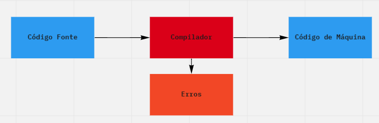

# Compilação e Interpretação {.P} 

Chegamos a um ponto interessante da nossa jornada. Já vimos um pouco da história de linguagens desenvolvidas para o uso humano e percebemos a
necessidade de uma linguagem que fosse entendida por máquinas. Nos resta entender como podemos traduzir uma na outra. Ou seja, como podemos
escrever um conjunto de instruções em uma linguagem que os humanos entendam e ter como resultado, um conjunto de instruções em uma
linguagem que as máquinas entendam. Como podemos traduzir uma linguagem
na outra?

Vamos dividir este processo de tradução em três técnicas distintas, mas
não excludentes, a compilação, a interpretação e os processos híbridos.
Contudo, antes de colocar a mão na massa e começar a destrinchar estas
técnicas, precisamos fazer algumas considerações importantes, a seguir,
principalmente porque se estamos em um livro sobre linguagem será bom se
todos estivermos usando a mesma.

-   **Algoritmo:** uma sequência finita de instruções que precisamos
    seguir para cumprir determinada tarefa ou resolver um determinado
    problema. Os algoritmos datam do Século IX e são atribuídos a mente
    criativa de *Abu Abdullah Muhammad ibn Musa Al-Khwarizmi*, um
    matemático Persa, também conhecido como o fundador da álgebra. A
    palavra algoritmo parece ter origem em uma publicação dos trabalhos
    de *Al-Khwarizmi* na Europa do Século XII, nesta publicação seu nome
    foi latinizado para *Algorithmi*. Algoritmos ideias escritas em uma
    linguagem de programação.

-   **Linguagem de programação:** vamos chamar de linguagem de
    programação uma linguagem formal e regular desenvolvida para uso
    humano, constituída por um conjunto finito e pré-determinado de
    *strings* formadas de símbolos retirados de um alfabeto finito
    $\Sigma$ qualquer. Este é o momento em que você deve pensar nas
    linguagens de programação que você conhece: C, Python, Assembly ou
    qualquer outra da sua preferência. Todas estas são linguagens
    formais e todas são linguagens de programação e todas são utilizadas
    para escrever um algoritmo na forma de um código.

-   **Código:** vamos chamar de código ao texto que você irá escrever na
    sua linguagem de programação preferida. O texto deverá obedecer a
    gramática, semântica e sintaxe da linguagem de programação que será
    utilizada pelo programador. Também podemos chamar, eventualmente, de
    código, o conjunto de instruções que será executado pela máquina,
    mas neste caso sempre usaremos a expressão código de máquina. O
    algoritmo, escrito na linguagem de programação é o código fonte do
    processo de compilação ou interpretação.

-   **Programa:** esta é uma definição controversa que enche a cabeça
    dos acadêmicos há algumas décadas. Neste livro, a palavra programa
    será utilizada apenas para representar o código de máquina que está
    em memória, sendo executado, ou que está armazenado em algum
    dispositivo para ser executado quando for conveniente. O programa é
    o resultado do processo de tradução de uma linguagem desenvolvida
    para humanos em uma linguagem desenvolvida para máquinas. O programa
    é o que resulta quando o compilador, ou o interpretador, traduz o
    seu código fonte, escrito em uma linguagem de programação em código
    de máquina.

-   **Tempos:** vamos dividir em tempos as fases do processo de criação
    de um programa. Sendo assim, temos o tempo de redação, este é o
    momento em que o programador está organizando suas ideias e
    escrevendo o código que representa seu algoritmo em uma determinada
    linguagem de programação. Em seguida, temos o tempo de compilação.
    Este é o momento em que o compilador está traduzindo seu código em
    código de máquina. Por fim, temos o tempo de execução, este é o
    momento em o seu programa está na memória e está sendo executado.

-   **Níveis:** frequentemente nos referimos as linguagens de
    programação como de alto ou baixo nível. Esta referência está
    diretamente ligada a distância que existe entre a linguagem e a
    máquina. Quanto mais perto do código de máquina uma linguagem de
    programação for, menor será o seu nível, *Assembly* é uma das
    linguagens de mais baixo nível. Por outro lado, quanto mais próximo
    das linguagens naturais uma linguagem de programação estiver, maior
    será o seu nível. O Python, o C e o Haskell são exemplos de
    linguagens de alto nível.

### Compilação

A palavra compilação significa o ato de selecionar informações, ou
materiais relevantes e adicioná-los a uma coleção. Neste livro vamos
chamar de compilação ao processo de transformar um texto, escrito em uma
linguagem formal e regular desenvolvida para Humanos em uma linguagem
formal e regular desenvolvida para máquinas de forma persistente. Uma
tradução.

A última parte da nossa definição "de forma persistente", é muito
importante para o entendimento do processo de compilação. Este "de forma
persistente" significa que o resultado do processo de compilação, o
código de máquina, de alguma forma permanece além da existência do
compilador, ou do programa, em algum dispositivo de armazenamento.

Jogando um pouco mais de luz no parágrafo anterior podemos dizer que um
compilador é um dispositivo, de hardware ou software, que traduz um
texto fonte, ou texto original, em outro texto, chamado de texto
objetivo. O texto fonte, ou código fonte, será escrito em uma linguagem
de programação, uma linguagem forma. O texto objetivo, ou código de
máquina, será escrito em uma linguagem de máquina. O resultado do
processo de compilação, o texto objetivo, será, de alguma forma,
armazenado para transporte e para o uso posterior.

A última frase do parágrafo anterior é muito importante: o resultado do
processo de compilação, o código de máquina, será, de alguma forma,
armazenado para transporte e uso posterior. Esta condição determina que
o resultado do trabalho do compilador é perene. Ele deve durar por um
tempo indefinido depois que o trabalho do compilador se encerra assim,
podemos armazenar o código de máquina, transportar o código entre
máquinas e executar este código em máquinas diversas, não importando
nenhuma referência de lugar e tempo. A única restrição a execução do
código de máquina gerado é que este código só poderá ser executado em
máquinas que atendam a arquitetura que escolhida para a geração do
código de máquina.

{width="5.905555555555556in"
height="2.3604647856517937in"}Uma consequência direta destas
funcionalidades e do fato de que uma linguagem de programação é uma
linguagem formal e regular é que os compiladores são capazes de emitir
mensagens de erro, durante o processo de compilação e, mais
recentemente, durante o processo de redação do algoritmo. A Figura 4
mostra, de forma genérica, o processo de compilação como vimos até o
momento.

O processo de compilação tem o seu próprio tempo separado do tempo de
redação e do tempo de execução. O compilador pode usar este tempo para
conseguir o melhor nível de otimização possível em busca do máximo de
eficiência no uso de recursos e velocidade durante a execução do código,
o tempo de execução. Os recursos utilizados para a execução de um
determinado código de máquina serão sempre, raros e caros. Desta forma,
é imprescindível que cada instrução seja analisada e otimizada em busca
do menor custo e da maior velocidade.

Vamos tentar entender todo o processo de compilação como sendo uma série
de blocos especializados em refinar, otimizar e modificar as informações
originadas no código fonte, em ordem, de forma que o bloco seguinte seja
capaz de agregar valor ao processo alterando e expandindo a forma da
informação envolvida no processo de tradução. Neste livro, vamos
utilizar como referência a divisão em blocos que pode ser vista na
Figura 6.

{width="5.061805555555556in"
height="4.477477034120735in"}

Figura 6 - Módulos componentes de um compilador

Cada um destes módulos tem funções específicas para tratar a informação
de entrada e passar esta informação para o próximo módulo de forma a
permitir que o próximo módulo trate essa informação da forma mais
eficiente possível.

O Analisador Léxico é responsável por analisar a formação das palavras,
operadores e símbolos da linguagem de programação, classificar estes
símbolos e passar a lista para o Analisador Sintático. Por sua vez, cabe
ao Analisador sintático verificar a forma como cada instrução foi
escrita, verificando a adequação da instrução as regras de sintaxe da
linguagem, uma vez que a instrução tenha sido validada, criar uma árvore
sintática abstrata (AST)[^16] .

O Analisador Semântico irá analisar a AST de forma criar a Arvore
Sintática Abstrata Aumentada (AAST). Esta árvore contém informações
referentes ao sentido de cada uma das instruções do código. Para criar
esta árvore coube ao Analisador Semântico a tarefa de entender o sentido
da instrução e marcar esta instrução com etiquetas que facilitem a
criação do código intermediário.

O módulo responsável pela Geração do Código intermediário irá
transformar a AAST em um código simples, próximo da linguagem *Assembly*
para a entrega ao módulo responsável pela otimização do código. O uso
deste código intermediário surge como uma forma de tornar mais simples e
eficiente fazer otimizações neste código antes de transformá-lo em
linguagem de máquina.

Ao longo do livro vamos ver cada um destes módulos com detalhe. Neste
momento você irá perceber que esta divisão é apenas didática e que pode
ser estendida ou reduzida de acordo com o objetivo de cada autor.

### Interpretação

O processo de interpretação consiste em traduzir um texto escrito em uma
linguagem formal e regular, desenvolvida para uso humano, em uma
linguagem formal criada para o uso por uma máquina específica. Ou, caso
não tenha sido óbvio, algo muito parecido com as tarefas executadas pelo
compilador. Existem, no entanto, alguns detalhes importantes. No
passado, o processo de interpretação era feito linha à linha e o
resultado deste processo era executado ou, quando fosse o caso, passado
para a próxima linha. Este processo é característico de linguagens como
o Basic. Hoje, com as linguagens muito mais complexas, contando com
artefatos como funções, objetos e templates, a interpretação linha a
linha é impossível, tendo sido indispensável a criação de um processo de
interpretação de código inteiro ou de blocos de código auto contidos.

Enquanto o compilador opera em seu próprio tempo, o interpretador é um
programa, ou dispositivo, criado para operar em tempo de execução.
Podemos ressaltar isso: interpretadores são sistemas criados para a
fazer a tradução entre uma linguagem de programação e o código de
máquina em tempo de execução. Isso implica que o interpretador deve ser
muito rápido. Esta necessidade exige que o processo de tradução,
executado pelo interpretador ocorre de forma simultânea ao processo de
execução do código fonte. Para que isso seja possível, o interpretador
começa a traduzir e executar blocos de código fonte assim que o programa
começa a ser executado. No processo de interpretação, não existe tempo
disponível para ciclos repetitivos de otimização. Esta desvantagem
aparente pode ser superada com algumas técnicas de otimização em tempo
de execução.

Uma diferença importante entre um compilador e um interpretador é que
compilador jamais executa o código de máquina, enquanto o interpretador
faz isso todas as vezes que é executado. Observe que, graças a isso, o
resultado do processo de compilação é persistente enquanto o resultado
do processo de interpretação e efêmero.

Vamos, apenas para entendimento, considerar que não há nenhuma diferença
entre o tempo de interpretação e o tempo de execução. Se considerarmos
assim, o código de máquina resultante está na memória no mesmo instante
de tempo em que o processo de interpretação está sendo executado. Esta
hipótese permite a criação de rotinas de otimização para o código que
está em execução. De fato, a linguagem Java e o V8 (interpretador de
Javascript do Navegador Chrome) usam estes tipos de técnicas e este uso
é parte do sucesso tanto do Chrome quanto do Java. Estes são os
processos híbridos.

### Processos Híbridos

Acho que já escrevi isso, mas, não custa nada repetir: recursos
computacionais serão sempre raros e caros. E esta é a alavanca que
impulsiona todo o desenvolvimento tecnológico além da criação de
soluções para problemas novos que a própria tecnologia criou. Quando
conseguimos resolver estes problemas de forma mais rápida, usando menos
recursos, geramos mais riqueza. Nesta busca de eficiência podemos
combinar conceitos de compilação e interpretação em ambientes híbridos
com compiladores e interpretadores trabalhando lado a lado de forma que
o resultado do todo seja melhor que o resultado da soma das partes.

O usuário digita o código fonte e manda executar. Iimgtamente o
processo de interpretação coloca o código de máquina na memória e inicia
o tempo de execução. Em tempo de execução, com o programa rodando,
podemos observar a eficiência de cada artefato de código em memória,
identificar artefatos que possam ser otimizados, disparar o compilador
em paralelo para otimizar este artefato ao máximo e, assim que os clico
extra de otimização estejam completos, substituir este artefato em
memória. E esta tecnologia que fez o sucesso do Java.

No caso do Java o compilador produz um código intermediário, o código
objeto que no caso do Java é chamado de *Bytecode*. este código é
persistente e altamente otimizado. Depois de gerado o *Bytecode* pode
ser interpretado em qualquer máquina virtual. Ou, em outras palavras,
você escreve seu código fonte uma única vez, gera o *Bytecode* e,
portando este código intermediário você pode executar seu programa em
qualquer arquitetura de hardware desde que exista uma máquina virtual
Java rodando nesta arquitetura.

O processo híbrido original do Java em duas fases distintas com um
interregno de portabilidade, não é a única opção de hibridismo que
podemos encontrar. O *Javascript*, uma linguagem criada para ser
executada em navegadores web é, geralmente, interpretada. O código fonte
é carregado junto com uma determinada página e cabe ao navegador
interpretar este código e executar as instruções desejadas. A fluidez da
navegação web depende da velocidade e eficiência do interpretador
*Javascript* dos navegadores. O Google Chrome *V8 engine* é um dos
melhores exemplos de sucesso nesta área.

O *V8 engine* é um motor de interpretação *Javascript*, desenvolvido em
*C++*, em código aberto, que está em desenvolvimento constante pela
equipe de desenvolvedores do Google na Alemanha. O *V8* usa dois
processos de tradução. O primeiro, um compilador muito rápido, cujo
processo de otimização é o mínimo, para que o código seja executado
iimgtamente. O segundo, um compilador de otimização que gera código de
máquina altamente eficiente e rápido. Este segundo compilador atua em
segundo plano, depois que o código já está rodando, e observa o processo
de uso do código de máquina, em memória e durante a execução do
programa, observando a existência, ou não de artefatos de código que
precisam de níveis mais profundos de otimização. Leia este parágrafo
novamente.

Acabei de falar que o interpretador do *V8 engine* é composto de dois
compiladores. Essa linha entre compilação e interpretação é tênue e
autores diferentes traçam esta linha em pontos diferentes. Neste livro
vamos tentar explicar as características de cada um, os algoritmos e
técnicas envolvidas e a forma como você poderá fazer uso destes
algoritmos para, além de projetar seu próprio compilador, ou
interpretador, usar este conhecimento para criar soluções mais rápidas,
eficientes e baratas.

Linguagens formais e regulares
==============================

The purely **formal language** of geometry describes adequately the
reality of space. We might say, in this sense, that geometry is
successful magic. I should like to state a converse: is not all magic,
to the extent that it is successful, geometry?

Rene Thom

Podemos começar o estudo das linguagens formais lembrando que apenas a
evolução da nossa espécie levou a criação da linguagem natural. Um
processo aleatório, resultado da evolução e do relacionamento social.
São naturais todas as linguagens que falamos e que são resultado desta
evolução.

O relacionamento social, certamente, foi o fator decisivo para a criação
de um conjunto de regras de uso e formação para cada uma das linguagens
naturais que existe de forma a permitir que estas linguagens naturais
pudessem ser aprendidas, praticadas e preservadas por todos os
indivíduos de uma aglomeração humana. O entendimento do que o outro fala
e a forma como ele fala fundamentam a convivência e evitam a violência e
afastam a guerra. Este resultado da evolução, as linguagens naturais,
por sua vez, permitiram a criação das linguagens artificiais. As
linguagens artificiais são as linguagens criadas pelo homem com um
objetivo específico, para entender uma necessidade ou resolver um
problema. São exemplos de linguagens artificiais, o *Haskell*, a Lógica
Proposicional de Aristóteles e as Partituras Musicais de Guittone d'
Arezzo. As duas últimas são exemplos de linguagens artificiais
ancestrais e servem para nos recordar que a criação de linguagens
artificiais não é exclusividade nem da modernidade nem da computação.

A partir da metade do Século XX, como vimos no Capítulo 1, as linguagens
artificiais explodiram em quantidade e diversidade. Notadamente graças
as linguagens de programação. Ao nosso estudo interessam apenas as
linguagens artificiais formais e regulares e usaremos os termos
*linguagem formal* e *linguagem regular* como se sinônimos fossem até
que destacar a diferença entre elas seja inevitável. Todas as linguagens
regulares são formais, mas nem todas as linguagens formais são
regulares. Da mesma forma, todas as linguagens formais são artificiais,
mas nem todas as linguagens artificiais são formais. O Esperanto é o
exemplo clássico de linguagem artificial não formal e, portanto, está
fora do escopo deste livro.

Ao longo deste livro usaremos os termos formal ou regular, para nos
referir à alguma coisa que seja passível de ser computável e, neste
caso, "passível de ser computável" implica forçosamente na necessidade
do uso de um algoritmo. E, muitas vezes vamos usar os termos linguagem
formal e linguagem regular de forma como se fossem sinônimos. Contudo,
existem linguagens formais que não são regulares. As linguagens formais
e regulares são o objeto de estudo deste livro.

Para que uma linguagem seja formal é necessário que a forma das suas
sentenças (sintaxe), e o seu significado (semântica), seja precisa,
rígida e algoritmicamente determinado. Veremos que uma linguagem será
considerada formal se suas instruções puderem ser identificadas por um
autômato finito ou por uma expressão regular, atendendo ao Teorema de
Kleene.

Uma linguagem, seja ela natural ou artificial, será um conjunto de
cadeias de símbolos, *strings*, formadas com base em um alfabeto finito
e pré-definido. A sintaxe irá determinar as formas destas *strings* sem
se preocupar muito com a forma dos seus menores componentes, os Lexemas.

Lexema é uma palavra originada do grego que representa a unidade mínima
de distinguível de um sistema semântico, seus sinônimos mais comuns são
morfema e palavra. Para nós, neste livro, o lexema é a menor unidade
significativa de uma linguagem. Pode ser, por exemplo a palavra *for* ou
o operador +. Cabe ao Analisador Léxico identificar os lexemas
específicos da linguagem que será compilada. Mas isso é andar um pouco
rápido demais. Vamos voltar as linguagens formais.

O estudo das linguagens formais começa com os conceitos de alfabeto,
*string*, operações com *strings* e a matemática que suporta estes
conceitos e operações.

A Base Matemática
-----------------

Compiladores e interpretadores trabalham com linguagens formais e
linguagens formais são estruturas matemáticas desenvolvidas na
linguística computacional. E podemos começar com a definição de
alfabeto.

### Alfabetos, *strings* e linguagens

Um alfabeto é um conjunto finito de símbolos, muitas vezes chamados de
símbolos terminais não repetitivos. Para todos os efeitos neste livro,
um símbolo é uma unidade abstrata que não tem significado em sí próprio
trata-se da unidade mais primitiva de dado que pode ser representada em
uma alfabeto. Em alguns alfabetos os símbolos detêm significado graças
ao seu uso específico. Como exemplo, podemos citar as letras maiúsculas
ou minúsculas do português. Cada letra em si, não tem significado, mas
nós as reconhecemos.

$$\Sigma_{\text{ptbr}} = \left\{ a..z,\ A..z \right\}$$

Os alfabetos não admitem repetições de símbolos e, atendem a definição
matemática de conjunto. Não existe nenhuma restrição quanto ao tipo de
símbolo que compõe um alfabeto, eles podem ser compostos por dígitos,
números reais, letras, caracteres, *emoji* ou qualquer outro tipo de do.
Representamos o alfabeto pelo caractere sigma maiúsculo: $\Sigma$. Dessa
forma podemos ter:

$$\Sigma = \left\{ a_{1},\ a_{2},\ a_{3},\ \ldots,\ a_{k} \right\}$$

Que representa a existência de uma alfabeto com $k$ elementos onde $k$ é
a cardinalidade do alfabeto e representa seu número de membros. Por
exemplo, a cardinalidade de um alfabeto $\Sigma_{\text{prbr}}\ $formado
apenas pelas letras do alfabeto do português seria dada por:

$$\left| \Sigma_{\text{ptbr}} \right| = \left| \left\{ a..z,\ A..z \right\} \right| = 52$$

Com um pouco mais de formalidade, podemos dizer que, se um alfabeto
contém um elemento $a$ dizemos que $a \in \Sigma$ e este elemento e $a$
será chamado de membro de $\Sigma$. Da mesma forma se $\Sigma$ não
contém $c$ então dizemos que $c \notin \Sigma$.

O alfabeto que não contém símbolos é um conjunto vazio e é representado
por $\varnothing$ observe que a cardinalidade de um conjunto vazio é
zero. Observe também que a ordem dos membros em um alfabeto não é
relevante.

Uma *string* em $\Sigma$ é um subconjunto de $\Sigma$, ordenado e com
possíveis repetições. A quantidade de símbolos em uma *string*,
determina sua cardinalidade que podemos chamar de comprimento.

A ordem dos elementos em um *string* é importante de tal forma que duas
*strings* com os mesmos elementos em ordem diferente, são *strings*
diferentes. Uma *string* que não contém símbolos do seu alfabeto ainda é
uma *string*, vamos chamá-la de vazia e representar pelo símbolo
$\varepsilon$, que será lido com *epsilon*. Note que a *string* vazia
$\varepsilon$ é comum a todos os alfabetos e que sua cardinalidade é
zero

A definição do símbolo $\varepsilon$ para representar uma *string* vazia
implica no banimento deste símbolo de todos os alfabetos que usaremos
neste livro para evitar a ambiguidade no seu significado.

Exemplo 1:

Considere o alfabeto $\Sigma = \left\{ a,b \right\}$. Defina o conjunto
de todas as *strings* possíveis deste alfabeto cujo comprimento seja
inferior a três.

$$S = \left\{ a,\ b,\ aa,ab,\ ba,\ bb \right\}$$

Formalmente representamos as *strings* usando a mesma norma que usamos
para a representação de conjuntos. Uma *string* $s$ de um alfabeto
$\Sigma = \left\{ 1,a \right\}$, deveria ser respresentada por:

$$s = \left\{ a,1,a \right\}$$

vamos adotar esta representação. Exceto quando formos tratar
especificamente de operações com *strings* podemos representar
$s = \left\{ a1a \right\}$, ou simplesmente $``a1a".$

Podemos aproveitar a oportunidade e definir outra entidade matemática
interessante a tupla. Tuplas são sequências finitas de elementos. o
número de elementos da sequência dá nome a tupla. Logo, uma tupla com
três elementos é uma $3 - tupla$, uma tupla com cinco elementos é uma
$5 - tupla$. A tupla com dois elementos é chamada de par. Se a ordem dos
elementos é importante, na definição da tupla, então as chamamos de
tuplas ordenadas. No caso da $2 - tupla$ termos o par ordenado Dessa
forma, podemos melhorar a definição de *string*: uma *string* de um
alfabeto $\Sigma$ é de comprimento $n$ maior que zero é uma $n - tupla$
ordenada do alfabeto $\Sigma$.

Exemplo 2:

Considere os alfabetos $\Sigma_{1} = \left\{ a,b,c \right\}$ e
$\Sigma_{2} = \left\{ 3 \right\}.$ Neste caso, podemos ter as seguintes
*strings*:

a)  $s_{1} = \left\{ \text{abc} \right\}$ a qual é uma *string de*
    > $\Sigma_{1}$;

b)  $s_{2} = \ \varepsilon$ e $s_{3} = \left\{ 3333 \right\}$ as quais
    > são *strings* de $\Sigma_{2}$;

O conceito de cardinalidade, discutido em relação a alfabetos e
*strings* permite a criação de uma notação um pouco diferente. Tomemos a
como exemplo a *string* $\text{aabb}$, neste caso a cardinalidade será
dada pelo número de símbolos da *string* então:

$$\left| \text{aabb} \right| = 4$$

Podemos afirmar, sem sombra de dúvida que
$\left| \varepsilon \right| = 0$. Ou seja, a cardinalidade, ou
comprimento, da *string* vazia é zero. Com estas duas definições
solidificadas podemos criar uma notação que especifique a quantidade de
elementos de um determinado tipo na *string* emprestando um pouco do
conceito de cardinalidade. Neste caso teremos:

$$\left| \text{aabb} \right| = 4$$

$$\left| \text{aabb} \right|_{a} = 2$$

$$\left| \text{aabb} \right|_{b} = 2$$

Resta definir a igualdade entre *strings* tomemos agora duas *strings*
quaisquer:

$$s_{1} = \left\{ a_{1},a_{2},\ a_{3},\ldots,a_{i} \right\} \land s_{2} = \left\{ b_{1},b_{2},b_{3},..,\ b_{i} \right\}$$

Podemos dizer que $s_{1} = s_{2}$ se e somente se $a_{i} = b_{i}$ para
todo e qualquer valor de $i$. Ou se preferir, um pouco menos de
formalidade, podemos determinar a igualdade entre duas *string* primeiro
comparando seus comprimentos e dois, comparando, da esquerda para
direita, todos os seus elementos. As *strings* serão iguais se o
comprimento for igual e todos os seus elementos forem iguais um a um na
mesma ordem.

A concatenação de *strings* é uma operação binária interessante.
Definimos a concatenação como uma operação binária que recebe como
operandos duas *strings* e retorna uma nova *string* formada pelas duas
anteriores. Podemos representar a concatenação de duas *strings*
$s_{1} = \left\{ \text{ab} \right\}$ e
$s_{2} = \left\{ \text{ba} \right\}$ como:

$$s_{1}s_{2} = \left\{ \text{ab} \right\}\left\{ \text{ba} \right\} = \left\{ \text{abba} \right\}$$

Formalmente diríamos que a concatenação de $s_{1}$ e $s_{2}$ é definida
por:

$$s_{1}s_{2} = \left\{ \text{xy} \right|\left( x \in s_{1} \right) \land (y \in s_{2})\}$$

Que vem a ser a definição exata de produto cartesiano se apenas
substituirmos $\text{xy}$ pelo par ordenado $\left( x,y \right)$ e de
onde podemos inferir algumas propriedades interessantes:

a)  $s\varepsilon = s$;

b)  $\varepsilon s = s$;

c)  $\varepsilon\varepsilon = \varepsilon;$

d)  $\left| \varepsilon{}s \right| = \left| s \right|;$

e)  a concatenação não é comutativa logo: $s_{1}s_{2} \neq s_{2}s_{1}$;

f)  a concatenação é associativa logo:
    > $s_{1}\left( s_{2}s_{3} \right) = \left( s_{1}s_{2} \right)s_{3}$;

g)  $\left| s_{1}s_{2} \right| = \left| s_{1} \right| + \left| s_{2} \right|,$

Outra operação interessante com *strings* é a reversão, ou como preferem
alguns autores reflexo. A reversão é uma operação unária que, quando
aplicada a uma *string* resulta em outra *string* de mesmo comprimento e
com todos os elementos na ordem inversa. Considere a *string*
$s = \left\{ \text{abcd} \right\}$ sua reversão será dada por:

$$s^{R} = \left\{ \text{abcd} \right\}^{R} = \left\{ \text{dcba} \right\}$$

Novamente existem algumas propriedades que devemos observar:

a)  $\varepsilon^{R} = \varepsilon$;

b)  $\left| s^{R} \right| = \left| s \right|$;

c)  Se $s = \left\{ a \right\}$ então $s^{R} = \left\{ a \right\}$;

d)  $s^{R}x = xs^{R}$

e)  $\left( s^{R} \right)^{R} = s$;

f)  $\left( s_{1}s_{2} \right)^{R} = s_{2}^{R}s_{1}^{R}$

Por último temos a repetição. Usamos a repetição para denotar *strings*
que sejam a concatenação da *string* com ela mesma. A repetição será
indicada por um número $m$ inteiro positivo $\mathbb{Z}^{+}$. Por
definição vamos considerar que $m = 0$ indica a *string* vazia. Ou seja:

$$\left\{ \begin{matrix}
s^{m} = s^{m - 1}s,\ m > 0 \\
s^{0} = \varepsilon \\
\end{matrix} \right.\ $$

Exemplo 3

Considere a *string* $s_{1} = \{ ab\}$, teremos:

1.  $s_{1}^{0} = \left\{ \varepsilon \right\};$

2.  $s_{1}^{1} = s_{1} = \{ ab\}$;

3.  $s_{1}^{2} = s_{1}s_{1} = \{ abab\}$;

4.  $\varepsilon^{0} = \varepsilon^{1} = \varepsilon^{2} = \varepsilon$

Agora que temos as definições de alfabeto e *string* podemos começar a
definir a linguagem $L$ como sendo um conjuto de *strings* de um
alfabeto especificado. Esta definição não contém um limite implícito
para a cardinalidade deste conjunto. Isto implica que podemos ter uma
linguagem $L$ qualquer que tenha um número infinito de membros, um
número finito de membros ou nenhum membro. No caso do estudo de
compiladores e interpretadores, consideraremos apenas linguagens formais
com cardinalidade finita. Ou seja,

$$0\ \  \leq \left| L \right|\  \leq \infty\ $$

Formalmente podemos usar a notação de conjuntos para definir uma
linguagem ser você considerar uma linguagem $L$ derivada do alfabeto
$\Sigma = \left\{ 1,2,3,4,5,6,7,8,9,10 \right\}$ podemos definir $L$ da
seguinte forma:

$$L = \left\{ x \right|x \in \Sigma^{*} \land x\mathbb{\in Z\ }\left| 30 < x < 90 \right\}$$

Em bom português podemos dizer que é uma linguagem formada por *string*
que representam os números inteiros maiores que 30 e menores que 90.

Exemplo 4:

Considere o alfabeto $\Sigma = \left\{ a,b \right\}$ e defina a
linguagem $L_{1}$ e $L_{2}$ sabendo que $L_{1}$ é formada por todas as
*strings* começadas com o símbolo $a$ com no máximo três membros e que
$L_{2}$ é formada por todas as *strings* que contém a mesma quantidade
de símbolos $a$ e $b$.

$$L_{1} = \left\{ a,\ aa,\ ab,\ aaa,\ aab,aba,\ abb \right\}$$

$$L_{2} = \left\{ ab,\ ba,\ aabb,\ abab,\ baba,\ bbaa,\ aaabbb\ldots \right\}$$

Neste ponto podemos observar que uma linguagem pode ser entendida como
sendo um conjunto de conjuntos em dois níveis distintos. No primeiro, um
conjunto não ordenado de membros, as *strings* no segundo nível, um
conjunto de símbolos terminais, o alfabeto.

Dada uma linguagem $L$ todas as *strings* pertencentes a essa linguagem
serão chamadas de lexemas ou palavras. Tomando a linguagem $L_{2}$
podemos dizer que $\text{aabb}$ é lexema, ou palavra, de $L_{2}$ ou,
formalmente dizemos que $aabb \in L_{2}$.

A cardinalidade de uma linguagem $L$ é o número de *strings*, ou se
preferir, número de instruções contidas nesta linguagem. A linguagem
$L_{2}$, que definimos anteriormente, tem cardinalidade infinita
enquanto $L_{1}$ tem cardinalidade igual a sete, ou seja:

$$\left| L_{1} \right| = \left| \left\{ a,\ aa,\ ab,\ aaa,\ aab,aba,\ abb \right\} \right| = 7$$

Observe que uma linguagem finita é um conjunto finito de *strings*
construídas a partir de um alfabeto também finito*.* Um caso especial de
linguagem é a linguagem vazia $L_{v} = \{\}$ que será representada pelo
símbolo $\varnothing$ cuja cardinalidade é zero
$\left| L_{v} \right| = 0.$ Outro caso especial é a linguagem
denominada, fecho de Kleene e representada por $\Sigma^{*}$. Esta
linguagem é, por definição, o conjunto de todas as *strings* de
comprimento finito que podem ser criadas utilizando os símbolos do
alfabeto $\Sigma$ acrescido da *string* vazia. Logo, considerando o
alfabeto $\Sigma = \left\{ a,b \right\}$ teremos:

$$\Sigma^{*} = \left\{ \varepsilon,a,\ b,\ ab,\ ba,\ aaa,\ aab,\ aba,\ abb,\ baa,\ bab,\ bba,\ bbb,\ \ldots \right\}$$

Exemplo 5:

Considere as linguagens $\Sigma^{*}$ em relação aos alfabetos propostos:

1.  Se $\Sigma = \left\{ a,b \right\}$ então
    $\Sigma^{*} = \left\{ \varepsilon,a,\ b,\ \text{ab},\ \text{ba},\ \text{aa},\ \text{bb},\ \text{aaa},\ \text{aab},\ \ldots \right\};$

2.  Se $\Sigma = \left\{ a \right\}$ então
    $\Sigma^{*} = \left\{ \varepsilon,\ a,\ \text{aa},\ \text{aaa},\ \text{aaaa},\ \ldots \right\}$;

3.  Se $\Sigma = \ \varnothing$ então
    $\Sigma^{*} = \left\{ \varepsilon \right\}.$

Neste caso, além de apresentar a linguagem $\Sigma^{*}$ na sua ordem
lexicográfica, podemos inferir que qualquer *string* derivada do
alfabeto $\Sigma$ é obrigatoriamente um membro da linguagem $\Sigma^{*}$
e qualquer linguagem $L$ do alfabeto $\Sigma$ é obrigatoriamente um
subconjunto da linguagem $\Sigma^{*}.$ Ou se preferir
$L \subset \Sigma^{*}$. Além disso, o conjunto formado por todos os
subconjuntos possíveis de $\Sigma^{*}$ é o conjuto de todas as
linguagens possíveis derivadas do alfabeto $\Sigma$.

Existe outra linguagem importantes derivada de um alfabeto $\Sigma$
qualquer e criadas por definição. A linguagem $\Sigma^{+}$que representa
todas as *strings* do alfabeto $\Sigma$ com comprimento maior ou igual a
1. Neste caso, a linguagem $\Sigma^{+}$ não incluí a *string* vazia
$\varepsilon$. Em resumo temos:

a)  a linguagem $L$ de um alfabeto $\Sigma$;

b)  a linguagem $\Sigma^{n}$ para todas as strings de comprimento $n$
    > para qualquer $n$ pertencente aos números naturais $\mathbb{N}$;

c)  A linguagem $\Sigma^{*}$, para todas as strings de $\Sigma$;

d)  A linguagem $\Sigma^{+}$ para todas as strings de $\Sigma$ com
    > comprimento maior ou igual a 1;

e)  A linguagem $\varnothing$ a linguagem sem nenhuma string do alfabeto
    > $\Sigma$.

Exemplo 6:

Considere o alfabeto $\Sigma_{b} = \left\{ 0,1 \right\}$

1.  $\Sigma_{b}$,
    $L = \ \Sigma_{b}^{2}\  \Rightarrow L = \left\{ 00,01,10,11 \right\}$

2.  $\Sigma_{b}$,
    $L = \ \Sigma_{b}^{8}\  \Rightarrow L = \left\{ 00000000,\ 00000001,\ldots \right\}$
    (bytes).

###  Operações com linguagens

Dado um alfabeto finito qualquer$\ \Sigma$ podemos afirmar que:

a)  $L = \varnothing$ é uma linguagem formal;

b)  Para qualquer *string*
    > $s \in \ \Sigma^{*},\ \ L = \left\{ s \right\}$ é uma linguagem
    > formal;

c)  Para qualquer *string*
    > $s \in \ \Sigma^{*},\ \ L = \left\{ s \right\}$ é uma linguagem
    > formal;

d)  Se $L_{1}$ e $L_{2}$ são linguagens formais então
    > $L_{1} \cup L_{2}$, é uma linguagem formal;

e)  Se $L_{1}$ e $L_{2}$ são linguagens formais então $L_{1}L_{2}$, é
    > uma linguagem formal;

f)  Se $L_{1}$ é uma linguagens formal então $L_{1}^{*}$ é uma linguagem
    > formal.

As afirmações que indicam que
$\varnothing,\ \left\{ x \right\}\text{e\ }\left\{ \varepsilon \right\}$
são linguagens formais são as afirmações básicas sobre as quais
construiremos, passo-a-passo, a definição de linguagem formal. As outras
três, derivadas das operações União, Concatenação e fechamento têm
importância ímpar para a definição das linguagens formais. Antes de
prosseguirmos, precisamos definir estas operações. Em linhas gerais,
tudo que teremos que fazer é observar as operações com *strings* e
aplicar a todas as *strings* da linguagem.

#### União

Trata-se de uma operação binária. Considere as linguagens $L_{1}$e
$L_{2}$ referentes ao alfabeto $\Sigma$. Definimos a união destas
linguagens como:

$$L_{1}{\cup L}_{2} = \left\{ \text{x\ } \right|\left( x \in L_{1} \right) \vee (y \in L_{2})\}$$

Exemplo 7:

Considere o alfabeto $\Sigma = \{ a,b,c\}$ e as linguagens
$L_{1} = \{\text{aa},\text{bb}\}$ e
$L_{2} = \left\{ \text{cc},\ cb \right\}$ neste caso a concatenação
entre estas duas linguagens será dada por:

$$L_{1}{\cup L}_{2} = \left\{ \text{aa},\text{bb} \right\}\left\{ \text{cc},\ cb \right\} = \{ aa,\ bb,\ cc,\ cb\}\ \ $$

Algumas propriedades da união são importantes para o estudo das
linguagens formais e regulares:

a\)
$L_{1} \cup \left( L_{2} \cup L_{3} \right) = {(L}_{1} \cup L_{2}) \cup L_{3}$
(associativa);

b\) $\left( L_{1} \cup L_{2} \right)L_{3} = L_{1}L_{3} \cup L_{2}L_{3}$
(associativa para concatenação).

#### Concatenação

Trata-se de uma operação binária. Considere as linguagens $L_{1}$e
$L_{2}$ referentes ao alfabeto $\Sigma$. Definimos a concatenação destas
linguagens como:

$$L_{1}L_{2} = \left\{ \text{xy\ } \right|\left( x \in L_{1} \right) \land (y \in L_{2})\}$$

Exemplo 8:

Considere o alfabeto $\Sigma = \{ a,b,c\}$ e as linguagens
$L_{1} = \{\text{aa},\text{bb}\}$ e
$L_{2} = \left\{ \text{cc},\ cb \right\}$ neste caso a concatenação
entre estas duas linguagens será dada por:

$$L_{1}L_{2} = \left\{ aa,bb \right\}\left\{ cc,\ cb \right\} = \{ aacc,\ aacb,\ bbcc,\ bbcb\}\ \ $$

A concatenação de uma linguagem $L$ consigo mesma, repetidamente dá
origem a uma representação muito próxima da representação da operação de
exponenciação. Sendo assim, considerando uma linguagem $L = \{ a,b\}$
teremos:

a)  $L^{0} = \varnothing$

b)  $L^{1} = L = \left\{ a,b \right\};$

c)  $L^{2} = LL = \left\{ a,b \right\}\left\{ a,b \right\} = \left\{ aa,\ ab,\ ba,\ bb \right\};$

d)  $L^{3} = LLL = \left\{ a,b \right\}\left\{ a,b \right\}\left\{ a,b \right\} = \left\{ aa,\ ab,\ ba,\ bb \right\}\left\{ a,b \right\} = \{ aaa,\ aba,\ baa,\ bba,\ aab,\ abb,\ bab,\ bbb\}$;

e)  $L^{k} = LLL\ldots L$ ($k$ vezes).

#### Fechamento de Kleene

O fechamento de Kleene, também chamado de fechamento recursivo
transitivo é uma operação unária. Se $L_{1}$ for uma linguagem
$L_{1}^{*}$ indica que podemos pegar zero ou mais *strings* de
$L_{1}^{*}$ e concatená-los. Definimos seu fechamento por:

$$L_{1}^{*} = \ \bigcup_{i = 0}^{\infty}{L_{1}^{\text{i\ }} = L^{0} \cup L^{1} \cup L^{2} \cup L^{3}\ldots}$$

Em palavras podemos dizer que o fechamento de Kleene de uma linguagem
dada é a união de todas as linguagens possíveis, formadas pela
concatenação dela com ela mesma, operação que definimos como repetição.

$$L^{n} = \ \left\{ \begin{matrix}
\{\varepsilon\} \\
L^{n - 1}L \\
\end{matrix} \right.\ $$

Por causa desta relação com a concatenação este fechamento é dito como
sendo um fechamento por concatenação e união, ou se preferir um pouco
mais de formalismo, podemos recorrer a álgebra abstrata. O $L^{*}$, é
chamado de monoide livre. E deste conceito podemos tirar o subgrupo
livre, também importado da álgebra, representado por $L^{+}$ definido
por:

$$L_{1}^{+} = \ \bigcup_{i = 1}^{\infty}{L_{1}^{\text{i\ }} = L^{1} \cup L^{2} \cup L^{3}\ldots}$$

Ou seja, todas as linguagens possíveis de serem criadas a partir de um
alfabeto $\Sigma$ excluindo a linguagem vazia. Ou ainda:

$$L^{+} = L^{*} - \{\varepsilon\}$$

A linguagem $\Sigma^{+}\ $é o resultado da operação unária chamada de
fechamento transitivo.

Exemplo 9:

Considere o alfabeto $\Sigma = \{ a,b,c\}$ e as linguagens
$L = \{\text{aa},\text{bb}\}$ neste caso o fechamento de $L_{1}$ será
dado por:

$$L_{1}^{*} = \left\{ \text{aa},\text{bb} \right\}^{*} = \ L^{0} \cup L^{1} \cup L^{2} \cup L^{3}\ldots$$

Logo:

$$L_{1}^{*} = \left\{ \text{aa},\text{bb} \right\}^{*} = \left\{ \varepsilon \right\},\left\{ aa,bb, \right\},\left\{ aaaa,aabb,bbaa,bbbb \right\},\ \left\{ aaaaa,\ldots \right\},\ \ldots\}\ $$

Finalmente temos que:

$$L_{1}^{*} = \{\varepsilon,\ aa,bb,aaaa,aabb,bbaa,bbbb,\ aaaaa,\ldots\}\ \ $$

O fechamento de Kleene de uma linguagem finita $L$ qualquer resulta em
uma linguagem infinita $L^{*}$, com apenas duas exceções: a linguagem
$\varnothing$ e linguagem que contém apenas a *string* vazia
$\left\{ \varepsilon \right\}$, nos dois casos, o resultado da operação
de fechamento será a própria linguagem.

Podemos voltar um pouco e ver as linguagens definidas anteriormente com
relação a um alfabeto e observar que dado um alfabeto $\Sigma$ qualquer
e uma linguagem $L$ derivada deste alfabeto o fechamento da linguagem
$L$ é igual a linguagem $\Sigma^{*}$, e contém todas as *strings*
possíveis do alfabeto $\Sigma$. Isso mostra que:

$$L \subseteq \Sigma^{*}$$

Equação que podemos extrapolar e ler como: toda e qualquer linguagem $L$
definida a partir de um alfabeto $\Sigma$ é um subconjunto de
$\Sigma^{*}$. Podemos destacar algumas propriedades interessantes do
fechamento por concatenação:

f)  $L \subseteq \Sigma^{*}$;

g)  $\forall\ L_{1} \in L^{*\ } \land \ L_{2} \in L^{*\ }|\ L_{1}L_{2} \in L^{*}$;

h)  $\left( L^{*} \right)^{*} = L^{*}$;

i)  $\left( L^{*} \right)^{R} = \left( L^{R} \right)^{*}$;

j)  $\varnothing^{*} = \varepsilon;$

k)  $\left\{ \varepsilon \right\}^{*} = \left\{ \varepsilon \right\}\text{.\ }$

Por fim, já que $\Sigma^{*}$ representa a maior linguagem possível
referente a um determinando alfabeto $\Sigma$ podemos definir o
complemento de uma linguagem como sendo:

$$\overline{L} = \Sigma^{*} - L$$

Exemplo 10:

Vamos considerar uma linguagem de programação qualquer que defina os
nomes dos seus identificadores, variáveis por exempo, como tendo que ser
escritos com letras maiúsculas e números. Podemos avaliar este problema
considerando dois alfabetos:

$$\Sigma_{\text{letras}} = \{ A,\ B,\ ..Z\}$$

$$\Sigma_{números} = \{ 0,1,2,3,4,5,6,7,8,9\}$$

De tal forma que o nosso alfabeto será:

$$\Sigma = \ \Sigma_{\text{letras}} \cup \Sigma_{números}$$

Com estes dois conjuntos podemos construir uma linguagem para as
variáveis utilizando a união e o fechamento de Kleene.

$$L_{\text{var}}\  \subseteq \Sigma^{*}\ $$

Que podemos ler como $L_{\text{var}}$ é um subconjuto de todas as
*strings* que podem ser criadas com a união dos dois alfabetos
definidos. O que inclui as *strings* vazias $\varepsilon$. Não parece
ser uma boa ideia ter uma linguagem de programação com a possibilidade
de termos identificadores, variáveis, que sejam *strings* vazias. Sendo
assim:

$$L_{\text{var}}\  \subseteq \Sigma^{+}$$

O que garante que podemos ter identificadores, formados por *strings* do
alfabeto $\Sigma$ de qualquer comprimento, usando qualquer combinação de
letras e numeros inteiros.

Neste ponto podemos fazer uma afirmaçao poderosa. Uma linguagem derivada
de um alfabeto será considerada regular se puder ser definida por meio
da *string* vazia e um conjunto finito de operações de união,
concatenação e fechamento. Ao conjunto destas operações, capazes de
determinar que uma determinada linguagem seja regular daremos o nome de
*expressões regulares*.

Expressões regulares
--------------------

Uma expressão regular é um forma lógica e algébrica para representar uma
linguagem formal, regular e complexa em termos de linguagens simples
combinadas por meio dos operadores de união, concatenção e fechamento.
Antes de nos aprofundarmos neste processo vamos melhorar um pouco a
forma como lemos estas expressões:

a)  União: pode ser lida como e, e representada por $\text{+}$ ou
    $\vee$;

b)  Concatenação: pode ser lida como "seguida por" ou "concatenado à";

c)  Fechamento: pode ser lido por "tantas \... quanto desejado";

> Assim:

$$x \vee dc^{*}$$

Pode ser lido como: *x e d seguido de quantos c desejarmos*.

Exemplo 11:

Considere o alfabeto $k = \left\{ 0,1 \right\}\ $a linguagem
$L = \{ 0^{j}1^{k}|m \geq 0,\ n \geq 0\}$, neste caso, podemos ler $L$
como sendo a linguagem formada por *strings* de qualquer quantidade de
zeros concatendos a qualquer quantidade de uns, ou seja:

$$L = \{\varepsilon,\ 0,\ 1,\ 00,\ 01,\ 10,\ 11,\ 000,\ldots\}$$

Com um pouco de formalismo podemos definir uma linguagem regular $R$
derivada de um alfabeto $\Sigma$ se pudermos expressar esta linguagem a
partir da aplicação de um conjunto finito de operações união,
concatenação e fechamento sobre um conjunto de linguagens mais simples,
que estejam contidas em $R$ começando com a linguagem vazia
$\varnothing$.

Expressões regulares são conjuntos diversos das operações de união,
concatenação e fechamento em uma notação. Sendo assim, podemos afirmar
que que qualquer linguagem $R$ derivada do alfabeto $\Sigma$ será
considerada regular se ela puder ser expressa apenas com as seguintes
regras:

a)  $\varnothing$ é uma expressão regular representa uma linguagem vazia
    $\text{\{}\}$;

b)  $\varepsilon$ é uma expressão regular e representa uma linguagem com
    uma *string*, a *string* vazia $\{\varepsilon\}$;

c)  se $s \in \ \Sigma^{*},\ \ s\ $é uma expressão regular e representa
    > uma linguagem com apenas uma string $\{ s\};$

d)  Se $R_{1}$ e $R_{2}$ são expressões regulares então
    > $R_{1} \cup R_{2}$, é uma expressão regular que representa uma
    > linguagem com todos os elementos de $R_{1}\text{e\ }R_{2};$

e)  Se $R_{1}$ e $R_{2}$ são expressões regulares então $R_{1}R_{2}$, é
    > uma expressão regular que representa uma linguagem resultante da
    > concatenação de $R_{1}R_{2}$;

f)  Se $R$ é uma expressão regular então $R^{*}$ é uma expressão
    > regular.

Onde cada uma destas expressões regulares representa um conjunto
contendo linguagens formais possíveis derivadas do mesmo alfabeto. O que
pode ser facilmente percebido comparando-se estes itens com as
afirmações feitas no início da seção 2.21 indicando que expressões
regulares são linguagens formais e regulares e vice-versa.

As expressões regulares são as ferramentas com as quais podemos criar
linguagens regulares. Podemos traçar um paralelo com a aritmética. Na
aritmética podemos utilizar as operações básicas para criar expressões,
no mundo da linguagem computacional usamos as expressões regulares para
criar linguagens. Ainda um pouco mais, podemos utilizar as expressões
regulares para validar uma determinada linguagem ou *string*.

> {width="5.905555555555556in"
> height="1.85625in"}{width="5.905555555555556in"
> height="3.370138888888889in"}

{width="5.905555555555556in"
height="2.5548611111111112in"}

{width="5.905555555555556in"
height="3.2444444444444445in"}

Analisador léxico
=================

Regularmente o Analisador Léxico é o primeiro módulo do processo de
compilação e mesmo da interpretação. Contudo, algumas linguagens de
programação como o *C* e o *C++* possuem um módulo anterior. O
Pré-processador. Veremos o pré-processador logo assim que tivermos a
base matemática necessária para

{width="5.905555555555556in"
height="3.1944444444444446in"}

 {.P}

# Material de apoio {.P}

 {.P}

Você pode baixar a versão em pdf desta aula [clicando aqui](./1-LingFormai.pdf) {.P}

 {.P}

# Obras Citadas {.P}

<small>
BARRAL, B. File:AnalyticalMachine Babbage London.jpg. Wikipedia, 2009. Disponivel em: <https://commons.wikimedia.org/wiki/File:AnalyticalMachine_Babbage_London.jpg#filelinks>. Acesso em: 20 Fev. 2020.  
BERGIN, T. J. 50 Years of Army Computing from Eniac to MSRC. Aberdeen, MD. USA: Army Research Laboratory, 1996.
BÖHM, C.; JACOPINI, G. Flow diagrams, turing machines and languages with only two formation rules. Communications of the ACM, v. 9, n. 5, p. 366-371, 1966.  
DAVIS, J. S. File:Commodore Grace M. Hopper, USN (covered).jpg. Wikipedia, 1984. Disponivel em: <https://en.wikipedia.org/wiki/File:Commodore_Grace_M._Hopper,_USN_(covered).jpg>. Acesso em: 20 Fev. 2020.  
DIJKSTRA, E. W. A Case against the GO TO Statement. Commun. ACM , v. 3, n. 1, p. 147-148, Mar. 1968.
KNUTH, D. E. Structured programming with go to statements. ACM Computing Surveys (CSUR), v. 6, n. 4, p. 261-301, 1974.  
MENABREA, L. F. The Analitical Engine Invented by Charles Babbage. Fourmilab, 1842. Disponivel em: <http://www.fourmilab.ch/babbage/sketch.html#NoteG>. Acesso em: 20 Fev. 2020.  
MICROSOFT. Microsoft Macro Assembler - Documentation. MSDN - Microsoft Developers Network, 2010. Disponivel em: <https://docs.microsoft.com/en-us/cpp/assembler/masm/microsoft-macro-assembler-reference?view=vs-2019>. Acesso em: 01 Mar. 2020.  
NAUR, P. et al. Revised report on the algorithmic language Algol 60. Communications of the ACM, v. 6, n. 1, p. 1-17, 1963.
WIKIMEDIA COMMONS. File:JohnvonNeumann-LosAlamos.gif --- Wikimedia Commons {.P}

</small>

[^1]: Em tradução livre: cálculos planos

[^2]: Em tradução livre: estruturas sintáticas

[^3]: ACM -- Association for Computing Machinery. Em tradução livre:
    Associação para a Máquinas Computationais.

[^4]: GAMM - Gesellschaft für Angewandte Mathematik und Mechanik. Em
    tradução livre: Sociedade para matemática e mecânica aplicadas.

[^5]: Em tradução livre: Compiladores, princípios, técnicas e
    ferramentas.

[^6]: Em tradução livre: cadeias. Mas, neste livro, vamos ignorar isso e
    usar *strings*.

[^7]: Intel; http://www.intel.com.br

[^8]: Em tradução livre: conjunto de instruções *x86_64* (cada *string*
    da linguagem tem 64 símbolos)

[^9]: Em tradução livre: programa de montagem simbólica otimizado.

[^10]: O Microsoft Macro Assembler pode ser instalado junto com o Visual
    Studio, de forma gratuita (MICROSOFT, 2010).

[^11]: Em tradução livre: etiqueta.

[^12]: Em tradução livre: correção de erro. Esta é uma outra referência
    a Grace Hopper e, se me permitir a audácia, sugiro que pesquise na
    internet: Grace Hopper e Bug. Esta é uma história que vale seu
    tempo.

[^13]: Em tradução livre: início e fim.

[^14]: Temos uma expressão para esse caso: código macarrônico.

[^15]: Em tradução livre: procedimento

[^16]: AST é uma abreviação da expressão inglesa *Abstract Sintact
    Tree*, ou, em tradução livre: árvore sintática abstrata.

